### ER DIAGRAM & RELATIONAL MODEL

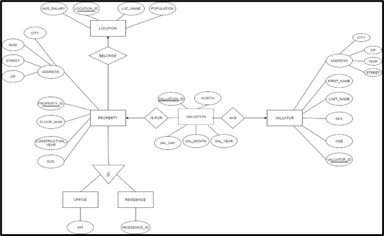

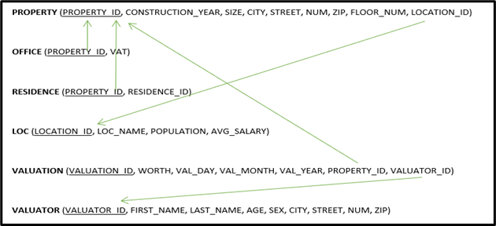

### TABLES CREATION

-- Create table loc 

    CREATE TABLE e_properties.loc (
    
    location_id VARCHAR(45) NOT NULL,
    
    loc_name VARCHAR(45) NOT NULL,
    
    population INT,
    
    avg_salary FLOAT,
    
    PRIMARY KEY (location_id));

-- Create table property

    CREATE TABLE e_properties.property (
    
    property_id INT NOT NULL,
    
    construction_year INT,
    
    size FLOAT,
    
    city VARCHAR(45),
    
    street VARCHAR(45),
    
    num INT,
    
    zip VARCHAR(10),
    
    floor_num INT,
    
    location_id VARCHAR(45) NOT NULL,
    
    PRIMARY KEY (property_id),
    
    FOREIGN KEY (location_id)
    
    REFERENCES e_properties.loc (location_id));

-- Create table office

    CREATE TABLE e_properties.office (
    
    property_id INT NOT NULL,
    
    vat INT,
    
    PRIMARY KEY (property_id),
    
    FOREIGN KEY (property_id)
    
    REFERENCES e_properties.property (property_id));
    
-- Create table residence   

    CREATE TABLE e_properties.residence (
    
    property_id INT NOT NULL,
    
    residence_id VARCHAR(15),
    
    PRIMARY KEY (property_id),
    
    FOREIGN KEY (property_id)
    
    REFERENCES e_properties.property (property_id));
  
-- Create table valuator

    CREATE TABLE e_properties.valuator (
    
    valuator_id VARCHAR(45) NOT NULL,
    
    first_name VARCHAR(45) NOT NULL,
    
    last_name VARCHAR(45) NOT NULL,
    
    age INT,
    
    sex VARCHAR(1),
    
    city VARCHAR(45),
    
    street VARCHAR(45),
    
    num INT,
    
    zip VARCHAR(10),
    
    PRIMARY KEY (valuator_id));

-- Create table valuation

    CREATE TABLE e_properties.valuation (
    
    valuation_id INT NOT NULL,
    
    worth FLOAT,
    
    val_day INT,
    
    val_month INT,
    
    val_year INT,
    
    property_id INT,
    
    valuator_id VARCHAR(45),
    
    PRIMARY KEY (valuation_id),
    
    FOREIGN KEY (property_id)
    
    REFERENCES e_properties.property (property_id),
    
    FOREIGN KEY (valuator_id)
    
    REFERENCES e_properties.valuator (valuator_id));
    
The final table results are:

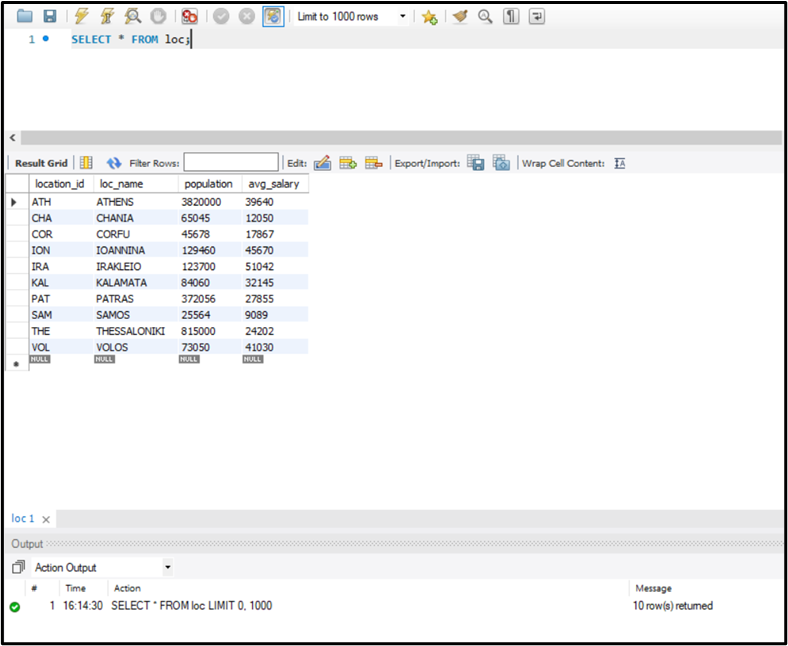
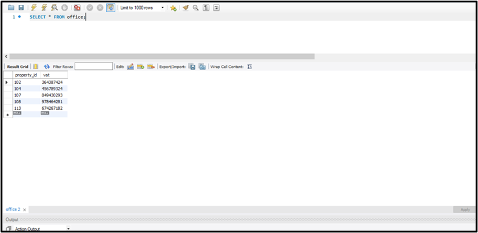
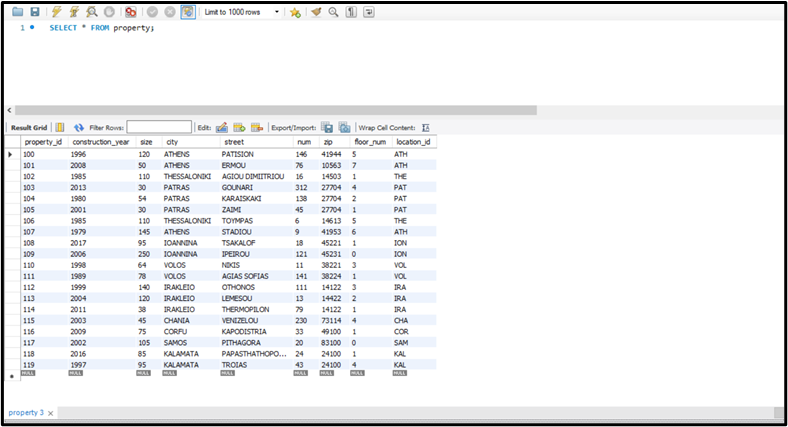
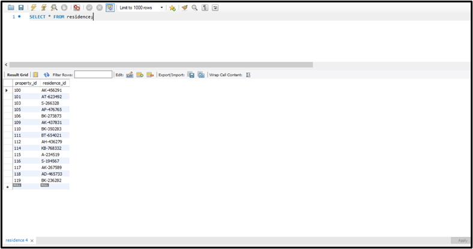
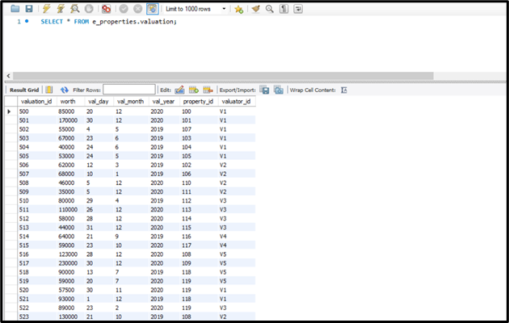
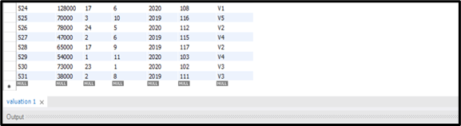
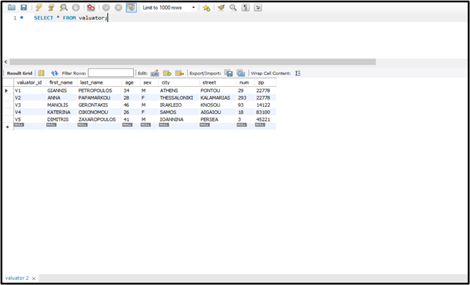

### QUESTION A.

Show the code and the address of the properties that belong to an area with an average income greater than €40,000 and have been estimated between 24/12/2020 and 31/12/2020.

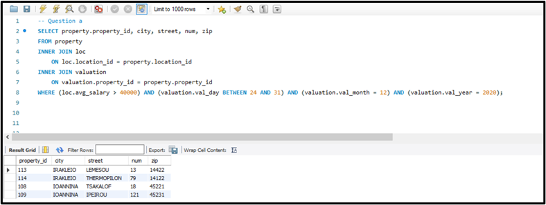

### QUESTION B.

For each valuator, show the number of valuations they have made in 2020.

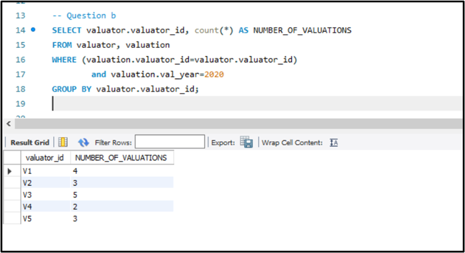

### QUESTION C.

Show the code of the properties that have been appraised more than two times within 2020.

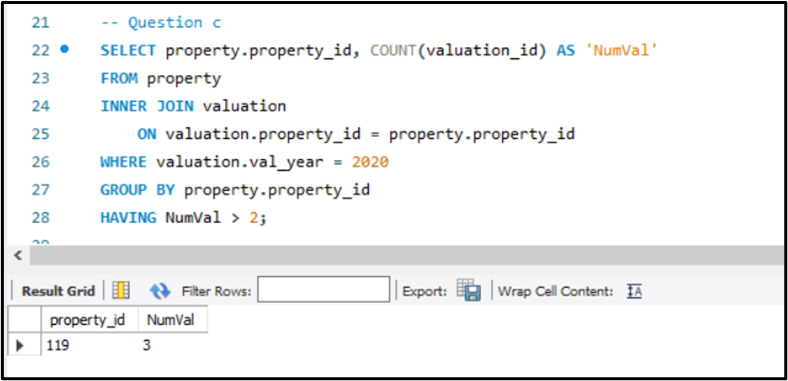

### QUESTION D.

Using nested queries, show the code of the estimations that have been made in areas with an average income greater than 25,000€.

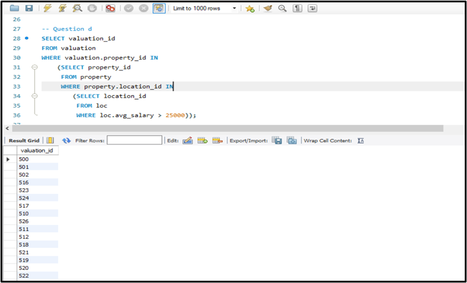
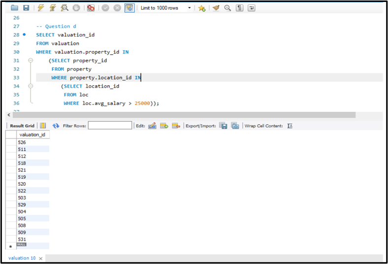

### QUESTION E.

Show the number of estimations made in 2020 for properties located in areas with a population > 50,000.

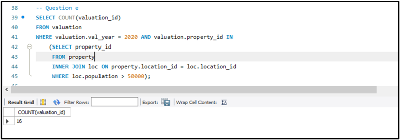

### QUESTION F.

For each area code, show the area code and the average estimated value per square meter of the area, in ascending order of the average estimated value

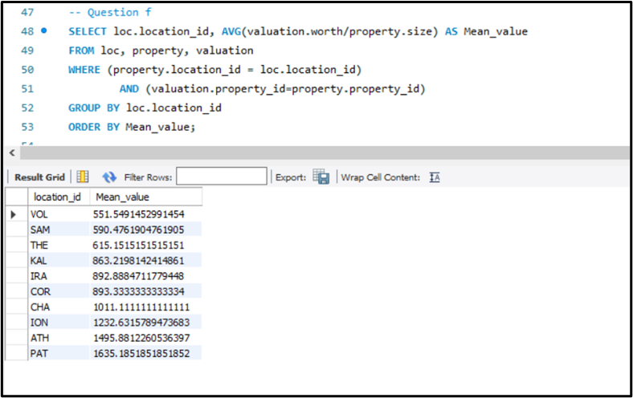

### QUESTION G.

For each valuator and for the year 2020, show the valuation code, the number of residential valuations they have made, and the number of office valuations they have made (3 columns).

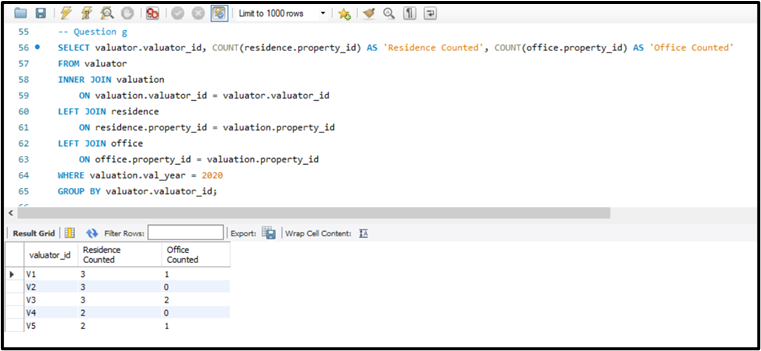

### QUESTION H.

For each area code, show the change in the average estimated value per square meter between 2020 and 2019.

	CREATE VIEW AverageVal2020 AS

	SELECT loc.location_id, AVG(valuation.worth/property.size) AS "AverageValSQ", valuation.val_year

	FROM loc

	INNER JOIN property 

		ON loc.location_id = property.location_id

	INNER JOIN valuation 

		ON valuation.property_id = property.property_id

	WHERE valuation.val_year = 2020

	GROUP BY loc.location_id;

	CREATE VIEW AverageVal2019 AS

	SELECT loc.location_id, AVG(valuation.worth/property.size) AS "AverageValSQ"

	FROM loc

	INNER JOIN property 

		ON loc.location_id = property.location_id

	INNER JOIN valuation 

		ON valuation.property_id = property.property_id

	WHERE valuation.val_year = 2019

	GROUP BY loc.location_id;

	SELECT AverageVal2020.location_id, (AverageVal2020.AverageValSQ - AverageVal2019.AverageValSQ) AS VarianceAverageValSQ_2020_2019

	FROM AverageVal2020

	INNER JOIN AverageVal2019

		ON AverageVal2020.location_id = AverageVal2019.location_id;
    
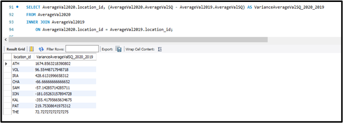

### QUESTION I.

For each area code and for the year 2020, show the number of estimations made in the area as a percentage of the total number of estimations made in 2020 (one column), and the population of the area as a percentage of the total population of all areas (one column).

	CREATE VIEW VTOTAL_FOR_LOC AS

	SELECT loc.location_id, COUNT(valuation.valuation_id) AS total_loc

	FROM loc

	INNER JOIN property

		ON loc.location_id=property.location_id

	INNER JOIN valuation

		ON valuation.property_id=property.property_id

	WHERE valuation.val_year=2020

	GROUP BY loc.location_id;

	CREATE VIEW VTOTAL_FOR_ALL AS

	SELECT COUNT(valuation_id) AS total_valuations_2020

	FROM valuation

	WHERE val_year=2020;

	CREATE VIEW POPULATION_LOC AS

	SELECT location_id, population AS pop_loc

	FROM loc	;

	CREATE VIEW POPULATION_TOTAL AS

	SELECT SUM(population) AS total_population

	FROM loc;

	SELECT  vtotal_for_loc.location_id, (total_loc/total_valuations_2020)*100 AS cnt_val, (pop_loc/total_population)*100 AS cnt_pop

	FROM vtotal_for_loc, vtotal_for_all, population_loc, population_total

	WHERE vtotal_for_loc.location_id=population_loc.location_id;

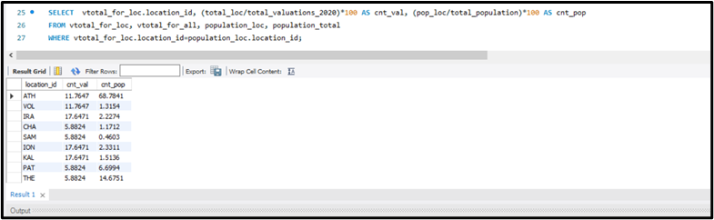

### PYTHON IMPLEMENTATION

Using any programming language you prefer, connect to the database and implement the query (i) above without using GROYP BY in the SQL statement, i.e., you can only use SELECT...FROM...WHERE.

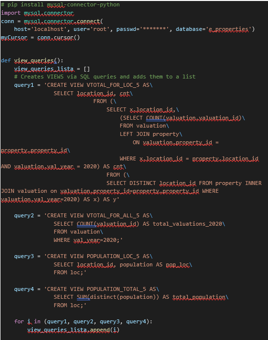
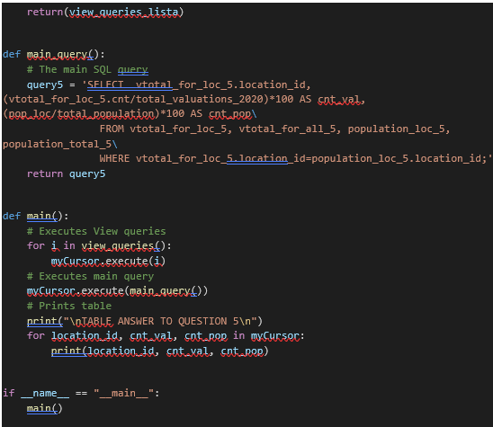
    
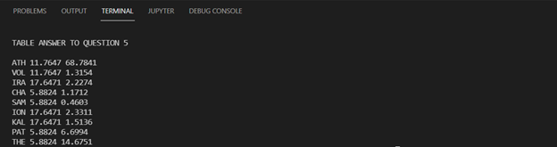
