## Introduction

You are going to use SQL Server Database, SQL Server Analysis Services and Power BI or Tableau for this project.
You are going to design and develop a data warehouse, build one or more data cubes on top of it, develop some
OLAP reports and visualize your results. You are going to present your project in Teams (10’-15’ each group). This
should be in the form of a business case. This includes:

- business goals, description of the problem/domain

- description of data sources, where did you find the datasets

- design of the data warehouse, cubes, etc

- import/cleaning/transformation challenges and what did you do

- examples of OLAP queries, reports, etc.

- visualization examples

1. Find a dataset in the web that seems attractive and interesting to you. Possible links:

    www.kaggle.com

    https://github.com/caesar0301/awesome-public-datasets

    http://www.kdnuggets.com/datasets/index.html

    https://catalog.data.gov/dataset?tags=data-warehouse

    or, search google for "datasets for data warehousing / data mining / OLAP / etc."

2. Understand the facts and the dimensions of the application. Define a star/snowflake schema in your database
SQLServer. Populate the fact and the dimension tables from the dataset you found - for example by using the
import task in your database server. You may have to clean, transform the dataset, manually define dimension
tables or insert values.

3. Use SQL Server Analysis Services to define a multi-dimensional model (a cube) over your schema. Play with the
reporting capabilities of your tool and show some OLAP reports (drill down/roll up, pivoting, ranking, etc.)

4. Install Power BI and using your database schema, show OLAP examples and visualize these - or whatever else
you consider interesting. Better (and more interesting/interactive/etc) visualizations mean better grade 
The deliverables (aside the presentation) should be a document (.doc or .pdf) describing in detail each of the
above steps - with a lot of screenshots: (a) what kind of application you are targeting, what dataset you used,
where did you find it, what problems you are trying to solve, what analysis you want to do, (b) description of the
relational design of your fact and dimension tables, import methods, cleaning/transformation procedures, (c) what
cube you have built on top of your schema, dimensions, measures, calculated - if any - measures; description (in
English) of OLAP reports and screenshots, and (d) visualizations of these reports and description of the
visualization, how it was produced, etc.

## Business Case

Auto+ is an upcoming auto auction-sales company which is planning to open its first warehouse/dealership, in the USA, at the beginning of 2016. To minimize the market entry risk, Auto+ asked our consulting company, OS Intelligence S.A., to provide them with a market analysis report of the car auctions market, in specific states of the USA, for the first half of 2015, as well as with visualization tools for better understanding and future use by the company.

## Report’s Targets

To provide Auto+ with useful insights about the preferences of the average used car auction sales customer in the USA as well as, suggest top car models to be supplied and best location to get their warehouse/dealership registered in, based on these preferences.

## Data Source

The dataset is called “used-car-auction-prices” and is provided in the following URL: https://www.kaggle.com/tunguz/used-car-auction-prices, by www.kaggle.com. The dataset includes historical data for used car auction sales in the USA for three months in 2014 & seven months in 2015.
The dataset has the following 16 columns:

●	year : The construction year of the car

●	make: The manufacturer of the car

●	model: The model of the car

●	trim: The trim of the car

●	body: The body type of the car

●	transmission: Whether the car is automatic or manual

●	vin: A unique code for the car

●	state: The state where the car was sold

●	condition: The condition of the car

●	odometer: The total number of miles the car has completed

●	color: The exterior color of the car

●	interior: The interior color of the car

●	seller: The name of the seller

●	mmr: The Manheim Market Report (MMR) is the premier indicator of wholesale price

●	sellingprice: The price that the car was sold

●	saledate: The date when the car was sold

## Data Import

First, we created a relational database in SQL Server called “used_cars”. Then, in Visual Studio, we created a Data Flow Task called “Import CSV” which includes a Flat-file Source and an SQL Server Destination. The Flat-file Source was imported with the cleaned CSV file of our dataset.
We connected SQL Server Destination to the Flat-file Source in order to connect our CSV directly to the database “used_cars” in SQL Server and used it to create a new table called “staging” in our database. By creating table “staging”, we declared the data types of our columns.

Creation of Table “staging” and Data Type per Column Declaration

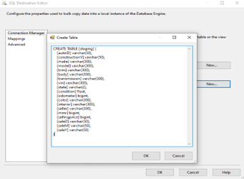

Finally, we chose the columns we will use in our report, connected the Flat-file Source to the SQL Server Destination and imported the CSV file to the “staging” table.

Selection of Columns and Connection of Flat-file Source to SQL Server Destination

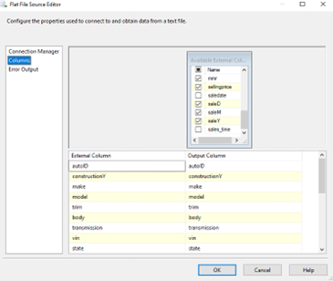
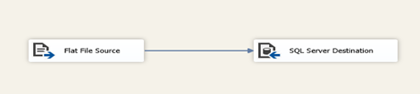

Furthermore, we connected the “Import CSV” process, with an SQL Execute Task, that would truncate our “staging” table each time we execute the data flow.

Connection of “Truncate Staging” to “Import CSV

Truncate Query Execution

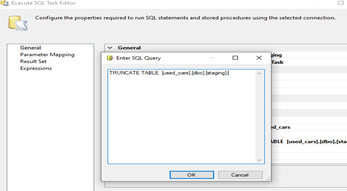

Afterwards, we defined the dimensions and measures for the fact table. After consideration, we decided that the following columns will be used as dimensions:

●	autoid
●	constructionY
●	make
●	model
●	trim
●	body
●	transmission
●	color
●	interior
●	state
●	vin
●	seller
●	saleD
●	saleM
●	saleY

and the following will be used as measures:

●	sellingprice
●	mmr
●	condition
●	odometer

To implement that, we created a new table for each dimension. In the following image we demonstrate the construction of a dimension table with a primary key and a column called “label_make” to insert the values of column make. The same procedure was followed for all the other Dimensions.

Creation of Table “make_dim”

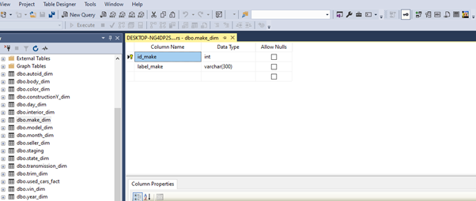

Afterwards, in Visual Studio, we created an Execute SQL Task for each dimension which contains the SQL Query that inserts values into our dimension tables and connected each one of them with the “Import CSV”.

SQL Insert Query for Table “make_dim”

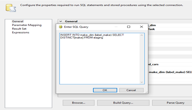

Finally, we created the fact table called “used_cars_fact” which contains as foreign keys the primary keys of each dimension and the 4 measures we described before. 

Fact Table Design and SQL Insert Query

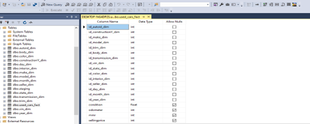
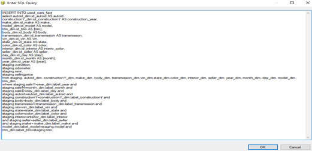

Afterwards, in Visual Studio, we created an Execute SQL Task for fact table which contains the SQL Query that inserts values into our fact table and connects it with each one dimension’s SQL Execute Task. The final running structure of our control flow in Visual Studio is the following:

Connection of “Update used_cars_fact” to the other Execute SQL Tasks

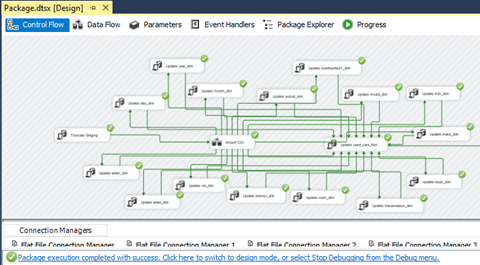

After executing the control flow, we can observe that every table is filled with values. By running a select statement in MSSQL we can assure that. We demonstrate the results of one dimension and of the fact table.

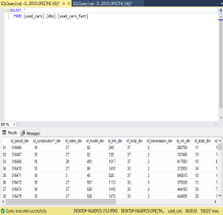  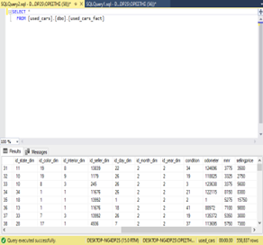  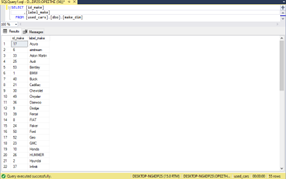

Finally, we deployed an SSIS Package which is responsible to execute the Visual from the SQL Server daily at 2 am.

Job Activity Monitor Creation

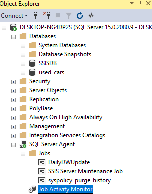

##Data Cube Deployment

We created a Multidimensional Analysis Services project in SSIS and connected it to our SQL Server relational database to create a cube with the help of Cube Wizard. Our final 
cube Schema is the following:

Cube Visualization

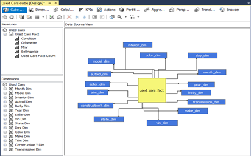

We matched dimensions and measures of our database to the Cube and calculated some extra measures (the averages of our already existing measures) to use them later in our visualizations.

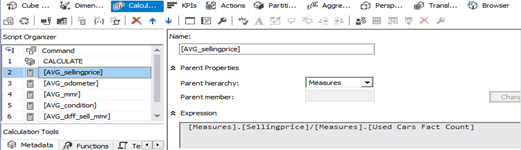
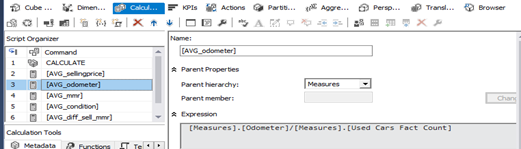
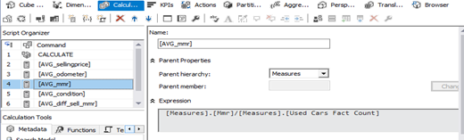
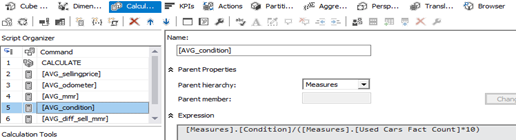
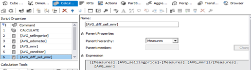

We connected the Cube to our Visual flow via an Analysis Services Processing Task.

Connection of ASPT to “Update used_cars_fact”

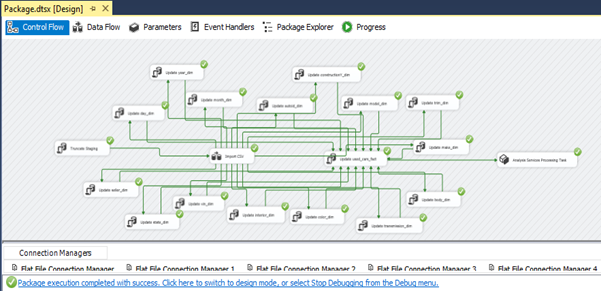

Finally, we connected our Cube to Power BI to visualize our data. The star schema of our database is the following:

Star Schema

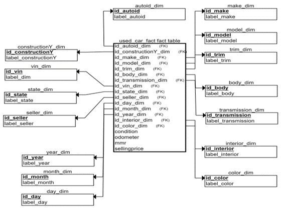

## Business Analysis

**Step 1**

Using Power BI, we created a visualization about the car auctions market and presented the most important features of it for the first 7 months of 2015. On the top, we created a stacked column chart which presented the Total and Top 5 Sales by Maker. The Total Sales reached 494.90k and the Top 5 Makers by Sales are Ford (76k), Chevrolet(50k), Nissan(40k), Toyota(32k) and Dodge(25k). The Top 5 constitutes 45% of the market’s Total Sales and are mostly USA and Japan produced cars which indicates that US citizens prefer the domestic car makers market but also, the well-established names of Japanese cars’ brands. Also, this indicates that it is easier for Auto+ to be supplied cars created by the Top 5 makers as there is greater supply and competitive prices for them in the US used cars market. Moreover, it is observed that, from the Total of Sales, the vast majority consists of automatic cars (437.25k) against manual cars (15.07k) which indicates the preference of US citizens to automatic cars. Finally, the most preferred colors in descending order are black, white, silver, gray, blue and red.

Market Analysis Report

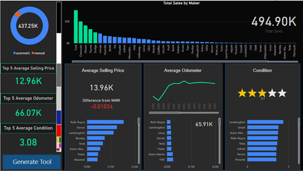

Furthermore, we studied the sales market by 3 competitive factors: 

●	Average Selling Price

●	Average Odometer

●	Average Condition

Average Selling Price: In this tab, is presented the Average Selling Price of the market and its difference from the MMR indicator while on the left is presented the Average Selling Price for the Top 5 makers. It is observed that the market values luxury cars the most as Rolls-Royce, Ferrari and Lamborghini are the highest priced cars while the Top 5 Sales cars are found mostly in the mid of the list. The Average Selling Price of the Top 5 is 12.96k and is lower from the general Average Price by 1k. This indicates that the Top 5 are in favor of the average US citizen in terms of average price and that selling price plays a critical role in the customer’s final decision. Finally, the difference between the Average Selling Price and the MMR indicator for the Total of the market, as well as, per maker presents almost zero difference which indicates low goodwill from the auction of used cars.   

Average Odometer: In this Tab, is presented the Average Odometer the cars of used cars market have completed and their correlation to the year the cars were constructed while on the left is presented the Average Odometer for the Top 5 makers. It is observed that the Average Odometer is highly negatively correlated to the construction year as it is getting higher while the construction year is ascending. There is a small number of outliers from 1984 and 1986 with very low mileage in contrast to their construction year but we can assume they are abandoned or unused cars. The Top 5 presents 66.07k on Average which is higher from the general average by 0.16k. The customers, on average, prefer cars close to 65.91k miles (the Average Odometer value) which indicates that they prefer cars with medium mileage. Chevrolet, Dodge and Toyota are most preferred as the construction year ascends, and this is why the Average Odometer of Top 5 is higher than the Average Odometer of general.

Average Condition: In this Tab, is presented the Average Condition of the cars while on the left is presented the Average Condition for the Top 5 makers. It is observed that the average car is in condition 3.1 in a scale 1-5. The Top 5 cars present an average of 3.08 Condition which is lower to the Average Condition by 0.02. This indicates that Customers prefer cars with at least a good rating of Condition.

In conclusion, Customers, on average, prefer cars that balance between mileage and condition but it is observed that a higher priority is given to selling price. The Customers are willing to purchase a car with average odometer and condition close to market’s average, while they prefer cars lower to average selling price by at least 1k.

**Step 2**

To get a more detailed view on the top 5 Makers’ cars, we created a tool that allows the user to compare models and trims from the Top 5 Makers. Users can choose their makers on the top of the page, models and trims on the lists left and right of the page and color on the bottom of the page. Additionally, they can observe the distribution of prices per maker, model and trim from the bar charts on the left and right bottom of the page. In this way, users can easily identify key differences on the selling price, mileage and condition and get supplied makers, models and trims that are closer to their customer preferences. Additionally, the user is able to visualize their car’s color choosing from a list of top 6 more applied colors. We used this tool in order to choose the best models from each maker and consult our customer on the best fit models they need to be supplied for their entry into the market.

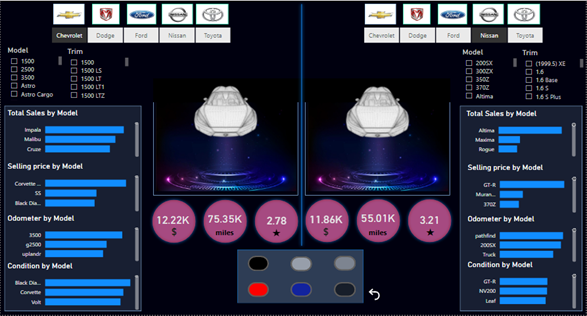

Similarly to Step 1, we observed the models of higher selling amount per maker and compared them to the average selling price, average odometer and average condition of the market. It is observed that:

●	For maker Chevrolet the top 2 models based on Sales are Impala (average selling price = 8.23k, average odometer = 80.41k, average condition = 2.5/5) and Malibu (average selling price = 9.22k, average odometer = 67.61k, average condition = 2.89/5).

●	For maker Dodge the top 2 models based on Sales are Grand Caravan (average selling price = 11.62k, average odometer = 64.70k, average condition = 2.59/5) and Charger (average selling price = 13.29k, average odometer = 63.24k, average condition = 2.60/5). 

●	For maker Ford the top 2 models based on Sales are F150 (average selling price = 19.20k, average odometer = 70.83k, average condition = 3.25/5) and Fusion (average selling price = 12.46k, average odometer = 46.87k, average condition = 3.51/5). 

●	For maker Nissan the top 2 models based on Sales are Altima (average selling price = 11.51k, average odometer = 49.04k, average condition = 3.25/5) and Maxima (average selling price = 13.31k, average odometer = 62.79k, average condition = 3.09/5).

●	For maker Toyota the top 2 models based on Sales are Camry (average selling price = 11.24k, average odometer = 66.05k, average condition = 3.08/5) and Corolla (average selling price = 9.34k, average odometer = 64.07k, average condition = 2.91/5). 

We created a scorecard to evaluate the Top Models:

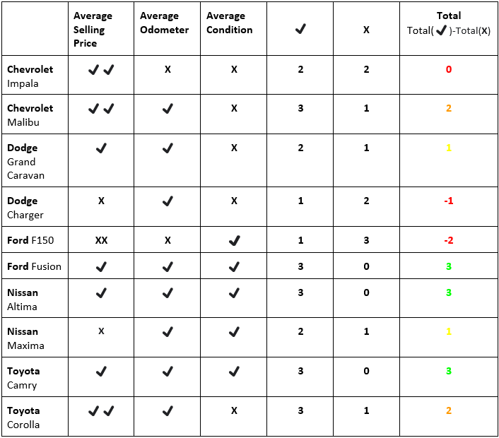
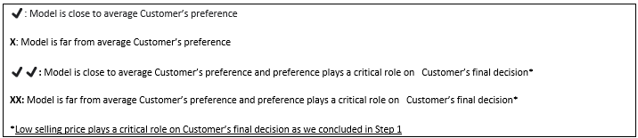

In conclusion, it is suggested that Auto+ could get supplied of models Chevrolet Malibu, Dodge Grand Caravan, Ford Fusion, Nissan Altima, Nissan Maxima, Toyota Camry and Toyota Corolla as they perform the highest on our scoreboard and it is believed that  Ford Fusion, Nissan Altima and Toyota Camry will outperform the other models on level of Sales as the higher and most balanced performers in terms of average selling price, average odometer and average condition of our scorecard.

**Step 3**

To decide about the best location to open the store, we created a report based on the Total Sales per State. It is observed that California State is the best choice for our client. While Florida is observed to be the highest on Total Sales among other states (74.65k), California State presents a high number of Total Sales (61.03k) and lower performance on our key factors in comparison to the car models we advised our customer to supply. More in detail, California’s average selling price is 14.84k in comparison to our stock’s selling price of 11.24k, California’s average odometer is 67.24 in comparison to our stock’s odometer of 60.16k and California’s average condition is 3.09 in comparison to our stock’s condition of 3.04. Moreover, the average MMR of California is +0.00261 which indicates a small profit on each car sale based on California’s average selling price. The low average selling price of our client’s stock is giving them the opportunity to sell on higher price and on a margin of +3.6k until California's market average selling price is reached.

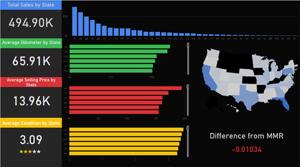

 **CALIFORNIA**
 
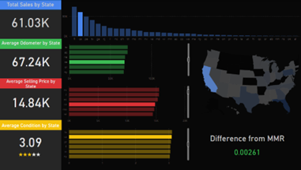

 **FLORIDA**
 
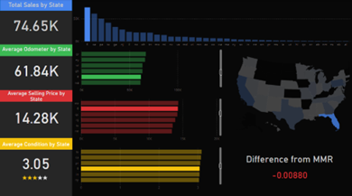
