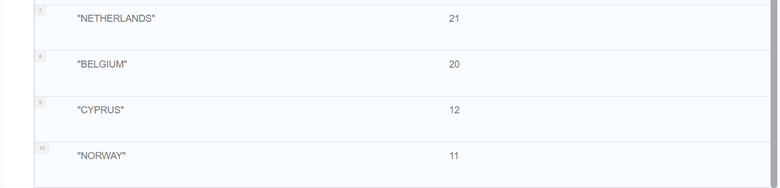
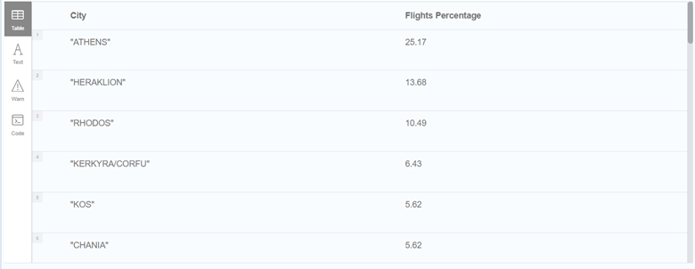
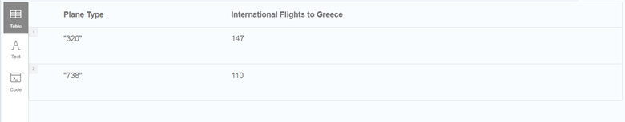

### **Description**

We are given a part of OpenFlights Airports network, which contains airports, airlines and flights between airports. In particular, the dataset contains 7698 Airports, 6161 Airlines, 6956 Cities, 237 Countries and 67.663 Flights between Airports. The dataset contains 3 csv files and a description for the attributes in each file. The scope of this analysis is to create a graph database using Neo4j tool with the above data and to identify the answers to questions related to the data.

### **Graph Schema**

The structure of the graph is presented in plots 1,2,3,4. Specifically, in plot 1, the Airlines’ nodes could be observed that include the Airline’s name and ID as attributes. In plot 2, the Airports’ nodes are presented that include the Airport’s City, Country, IATA Code, Latitude, Longitude, Name, and ID as attributes. In plot 3, the Routes’ nodes are presented that include the Route’s Airline, Destination Airport, Plane Type and Source Airport as attributes. Finally, in plot 4, the relationships between the above nodes presented. In detail, each flight belongs to an Airline company, while each Route departs and arrives at an Airport.

Figure 1 Airline Nodes

Figure 2 Airport Nodes

Figure 3 Route Nodes

Figure 4 Graph Schema

### **Import of Data and Creation of Database**

As mentioned in description, 3 csv files were used to create the database. We used the following cypher queries in Neo4j to import the Nodes and create the relationships between them:

**1)	To create the constraints for the Airline and Airport Nodes to avoid duplicate id values:**

CREATE CONSTRAINT ON (a:Airline) ASSERT a.id IS UNIQUE;

CREATE CONSTRAINT ON (p:Airport) ASSERT p.id IS UNIQUE;

**2)	To import the airline nodes:**

LOAD CSV WITH HEADERS

FROM "file:///airlines.csv" AS line

WITH DISTINCT line

MERGE (airline:Airline{ id: toInteger(line.`AirlineID`)})

SET airline.Name = toUpper(line.`Name`)
 
**3)	To import the airport nodes:**

LOAD CSV WITH HEADERS

FROM "file:///airports.csv" AS line

WITH DISTINCT line

MERGE (airport:Airport{ id: toInteger(line.`AirportID`)})

SET airport.Name = toUpper(line.`Name`),

    airport.City = toUpper(line.`City`),
    
    airport.Country = toUpper(line.`Country`),
    
    airport.IATA = toUpper(line.`IATA`),
    
    airport.Latitude = line.`Latitude`,
    
    airport.Longitude = line.`Longitude`

**4)	To import the route nodes:**

LOAD CSV WITH HEADERS

FROM "file:///routes.csv" AS line

MERGE (r:Route {RouteID: toUpper(toString(line.Source) + toString(line.Destination))})

SET r.Airline = toInteger(line.`AirlineID`),

    r.PlaneType = toUpper(line.`Equipment`),
    
    r.SourceAirport = toUpper(line.Source),
    
    r.DestinationAirport = toUpper(line.Destination)

**5)	To create the ‘Belongs to’ Relationship between Airlines and Routes:**

MATCH (r:Route)

MATCH (airline:Airline)

WHERE r.Airline = airline.id

MERGE (r)-[:BelongsTo]->(airline)

**6)	To create the ‘DepartsFrom’ Relationship between Airports and Routes:**

MATCH (r:Route)

MATCH (airport:Airport)

WHERE r.SourceAirport = airport.IATA

MERGE (r)-[:DepartsFrom]->(airport)

**7)	To create the ‘ArrivesTo’ Relationship between Airports and Routes:**

MATCH (r:Route)

MATCH (airport:Airport)

WHERE r.DestinationAirport = airport.IATA

MERGE (r)-[:ArrivesTo]->(airport)

### **Queries Results**

**Query 1: Which are the top 5 airports with the most flights. Return airport name and number of flights.**

CALL {MATCH (r:Route)-[:ArrivesTo]->(airport:Airport)
      
RETURN airport.Name AS `Airport Name`, COUNT(*) AS count
      
    UNION
      
MATCH (r:Route)-[:DepartsFrom]->(airport:Airport)
      
RETURN airport.Name AS `Airport Name`, COUNT(*) AS count
      
}

RETURN `Airport Name`, SUM(count) AS `Total Flights`

ORDER BY `Total Flights` DESC

LIMIT 5;

**Query 2: Which are the top 5 countries with the most airports. Return country name and number of airports.**
    
MATCH (a:Airport)

RETURN a.Country AS Country, COUNT(*) AS count

ORDER BY count DESC

LIMIT 5;

**Query 3: Which are the top 5 airlines with international flights from/to ‘Greece’. Return airline name and number of flights.**

MATCH (rin:Route)-[:ArrivesTo]->(airin:Airport)

MATCH (rin)-[:DepartsFrom]->(airout:Airport)

MATCH (rin)-[:BelongsTo]->(airline:Airline)

WHERE ((airin.Country<>'GREECE' AND airout.Country='GREECE')
       
OR (airin.Country='GREECE' AND airout.Country<>'GREECE'))

RETURN airline.Name AS `Airline Name`, COUNT(*) AS `Total Flights From/To Greece`

ORDER BY `Total Flights From/To Greece` DESC

LIMIT 5;

**Query 4: Which are the top 5 airlines with local flights inside ‘Germany’. Return airline name and number of flights.**

MATCH (rin:Route)-[:ArrivesTo]->(airin:Airport)

MATCH (rin)-[:DepartsFrom]->(airout:Airport)

MATCH (rin)-[:BelongsTo]->(airline:Airline)

WHERE ((airin.Country='GERMANY' AND airout.Country='GERMANY'))

RETURN airline.Name AS `Airline Name`, COUNT(*) AS `Local Flights in Germany`

ORDER BY `Local Flights in Germany` DESC

LIMIT 5;

**Query 5: Which are the top 10 countries with flights to Greece. Return country name and number of flights.**

MATCH (rin:Route)-[:ArrivesTo]->(airin:Airport)

MATCH (rin)-[:DepartsFrom]->(airout:Airport)

MATCH (rin)-[:BelongsTo]->(airline:Airline)

WHERE ((airin.Country='GREECE') AND (airout.Country <> 'GREECE'))

RETURN airout.Country AS `Country`, COUNT(*) AS `Flights to Greece`

ORDER BY `Flights to Greece` DESC

LIMIT 10;

**Query 6: Find the percentage of air traffic (inbound and outbound) for every city in Greece. Return city name and the corresponding traffic percentage in descending order.**

CALL {MATCH (r:Route)-[:ArrivesTo]->(airport:Airport)

WHERE(airport.Country = 'GREECE')

RETURN  COUNT(*) AS count

    UNION
    
MATCH (r:Route)-[:DepartsFrom]->(airport:Airport)

WHERE(airport.Country = 'GREECE')

RETURN COUNT(*) AS count

}

WITH SUM(count) AS `Total Flights`

CALL {MATCH (r:Route)-[:ArrivesTo]->(airport:Airport)

WHERE(airport.Country = 'GREECE')

RETURN  airport.City AS City ,COUNT(*) AS `Flights Proportion`

    UNION
    
MATCH (r:Route)-[:DepartsFrom]->(airport:Airport)

WHERE(airport.Country = 'GREECE')

RETURN  airport.City AS City ,COUNT(*) AS `Flights Proportion`

}

RETURN City, ROUND((SUM(`Flights Proportion`)*1.0/`Total Flights`)*100,2) AS `Flights Percentage`

ORDER BY `Flights Percentage` DESC;

**Query 7: Find the number of international flights to Greece with plane types ‘738’ and ‘320’. Return for each plane type the number of flights.**

MATCH (rin:Route)-[:ArrivesTo]->(airin:Airport)

MATCH (rin)-[:DepartsFrom]->(airout:Airport)

WHERE ((airin.Country='GREECE' AND airout.Country <>'GREECE')

AND (rin.PlaneType='738'OR rin.PlaneType='320' ))

RETURN rin.PlaneType AS `Plane Type`, COUNT(*) AS `International Flights to Greece`

**Query 8: Which are the top 5 flights that cover the biggest distance between two airports (use function point({ longitude: s1.longitude, latitude: s1.latitude }) and function distance(point1, point2)). Return From (airport), To (airport) and distance in km.**

MATCH (rin:Route)-[:ArrivesTo]->(airin:Airport)

MATCH (rin)-[:DepartsFrom]->(airout:Airport)

WITH point({longitude: toFloat(airout.Longitude), latitude: toFloat(airout.Latitude)}) as p1, point({longitude: toFloat(airin.Longitude),latitude: toFloat(airin.Latitude)}) as p2, airin.Name as `Airport From`,airout.Name as `Airport To`

RETURN DISTINCT `Airport From`,`Airport To`, round((point.distance(p1,p2)/1000),2) as `Distance in km` 

ORDER BY `Distance in km`  DESC

LIMIT 5;

**Query 9: Find 5 cities that are not connected with direct flights to ‘Berlin’. Score the cities in descending order with the total number of flights to other destinations. Return city name and score.**

CALL {MATCH (rin:Route)-[:ArrivesTo]->(airin:Airport)

MATCH (rin)-[:DepartsFrom]->(airout:Airport)

WHERE (airin.City='BERLIN')

WITH airin.City AS `Stop`,

    COLLECT(airout.City) AS `FromAir`
    
MATCH (r)-[:DepartsFrom]->(airpout:Airport)

WHERE NOT (airpout.City) IN `FromAir`

RETURN airpout.City AS `Airport From`

}

RETURN `Airport From`, COUNT(*) AS `Number of Routes`

ORDER BY `Number of Routes` DESC

LIMIT 5;

**Query 10: Find all shortest paths from ‘Athens’ to ‘Sydney’. Use only relations between flights and city airports.**

MATCH (airin:Airport {City:'SYDNEY', Country:'AUSTRALIA'})

MATCH (airout:Airport {City:'ATHENS', Country:'GREECE'})

MATCH p = allShortestPaths((airout)-[:DepartsFrom|ArrivesTo*]-(airin))

RETURN DISTINCT [n in nodes(p) | n.City] AS `All Shortest Paths`, length(p) as `Path Length`

In the results of 10th query, null values could be observed in the sequencies of the shortest paths. This occurs due to the fact that the Airport Nodes are connected through Route Nodes and given that Route Nodes do not include a City attribute, this leads to the null values being introduced.
