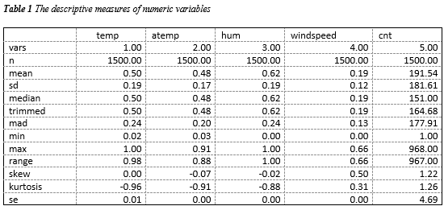
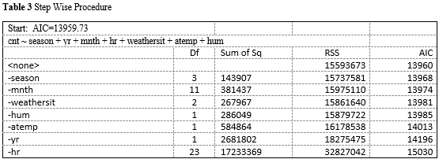
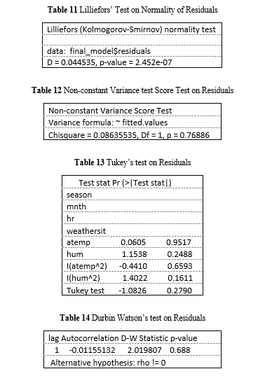
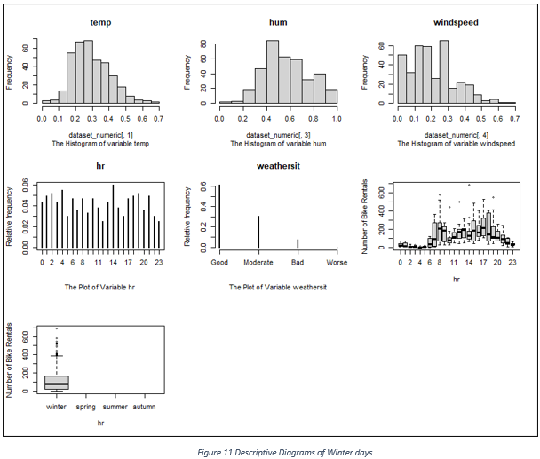
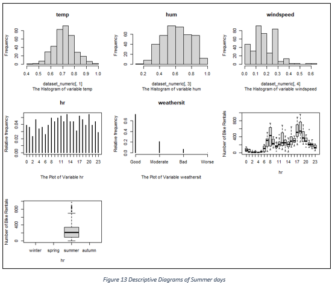
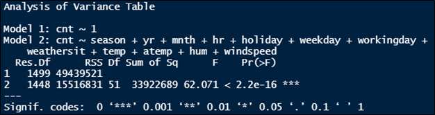

### Contents

1. [Introduction]
2. [Descriptive Analysis and Exploratory Data Analysis]
3. [Pairwise Comparisons]
4. [Predictive or Descriptive Models]
5. [Further Analysis]
6. [Conclusions and Discussion]
7. [Appendix]

### 1. Introduction

The main purpose of the assignment is to understand what influences bike rentals hourly and predict them to satisfy demand. To do so, we will create a statistical model based on data from the dataset “bike_13.csv” and we will test our model using the dataset “bike_test.csv”. For the purposes of the assignment to highlight the use of multiple linear regression on a dependent variable that follows the Normal Distribution, the multiple linear regression is used, although the most appropriate distribution would be the Poisson Distribution as bike rentals is a discrete non-negative number. The datasets “bike_13.csv” and “bike_test.csv” are random sub-samples extracted from a combination of datasets:

•	Core dataset is related to the, aggregated on hourly basis, two-year historical log corresponding to years 2011 and 2012 from Capital Bikeshare system, Washington D.C., USA which is publicly available in http://capitalbikeshare.com/system-data

•	Weather information are extracted from http://www.freemeteo.com

### 2. Descriptive analysis and exploratory data analysis

The dataset “bike_13.csv” consists of 1500 observations of 17 variables of which 13 are of class integer, 4 are of class numeric and 1 of class character. No NAs and blank values exist. The variable names and descriptions are:

•	instant (int): record index

•	dteday (chr): date 

•	season (int): season (1: winter, 2: spring, 3: summer, 4: autumn) 

•	yr (int): year (0: 2011, 1:2012) 

•	mnth (int): month (1 to 12) 

•	hr (int): hour (0 to 23)

•	holiday (int): day (0: not holiday, 1: holiday) 

•	weekday (int): day of the week (0: Sunday to 6: Saturday)

•	workingday (int): day (0: weekend or holiday, 1: working day)

•	Weathersit (int): Possible outcomes 

	1: Good: Clear, Partly cloudy
	2: Moderate: Cloudy/Broken clouds/Few clouds/Misty
	3: Bad: Light Rain + Thunderstorm + Scattered clouds/Light Rain + Scattered clouds 
	4: Worse: Heavy Rain + Ice Pallets + Thunderstorm + Mist, Snow + Fog
    
•	temp (num): Normalized temperature in Celsius. The values are divided to 41 (max) 

•	atemp (num): Normalized feeling temperature in Celsius. The values are divided to 50 (max) 

•	hum (num): Normalized humidity. The values are divided to 100 (max) 

•	windspeed (num): Normalized wind speed. The values are divided to 67 (max)

•	casual (int): count of casual users 

•	registered (int): count of registered users 

•	cnt (int): count of total rental bikes including both casual and registered (response)

First, we exclude variable instant as it adds no material information to the dataset and variable dteday as it can be described by variables yr, mnth and weekday. Also, we exclude variables registered and casual as they include the count of bike rentals which we want to predict affecting the fitting of our final model. Afterwards, we change the class of variables season, yr, mnth, hr, holiday, weekday, weathersit to factor and the rest of integer variables to numeric. By calculating the descriptive measures of numeric variables in Table 1, it is observed that:
Variables temp, atemp, hum, windspeed have equal mean and median indicating their data are following the Normal Distribution. This means that 99.7% of their data would be spread |3σ| around the mean. Specifically, temp data would be spread |3 x 0.19|, atemp |3 x 0.17|, hum |3 x 0.19| and windspeed |3 x 0.12| around the mean.
The skewness of variables windspeed and cnt is positive indicating right skewed distributions and data concentrated to lower values while the skewness of variables temp, atemp and hum is almost zero which is another indicator of Normal Distribution.
Variables temp, atemp and hum have higher negative kurtosis and variable cnt higher positive kurtosis exhibiting tail data that exceed the tails of the normal distribution.


```python
dataset <-read.csv2("bike_13.csv")
str(dataset)
#1
#delete variable X,instant,dteday,casual,registered
dataset <- dataset[,c(-1,-2,-3,-16,-17)]

#check for NAs
dataset$season[dataset$season == ""] <- NA; sum(is.na(dataset$season))
dataset$yr[dataset$yr == ""] <- NA; sum(is.na(dataset$yr))
dataset$mnth[dataset$mnth == ""] <- NA; sum(is.na(dataset$mnth))
dataset$hr[dataset$hr == ""] <- NA; sum(is.na(dataset$hr))
dataset$holiday[dataset$holiday == ""] <- NA; sum(is.na(dataset$holiday))
dataset$weekday[dataset$weekday == ""] <- NA; sum(is.na(dataset$weekday))
dataset$weathersit[dataset$weathersit == ""] <- NA; sum(is.na(dataset$weathersit))
dataset$temp[dataset$temp == ""] <- NA; sum(is.na(dataset$temp))
dataset$atemp[dataset$atemp == ""] <- NA; sum(is.na(dataset$atemp))
dataset$hum[dataset$hum == ""] <- NA; sum(is.na(dataset$hum))
dataset$windspeed[dataset$windspeed == ""] <- NA; sum(is.na(dataset$windspeed))
dataset$cnt[dataset$cnt == ""] <- NA; sum(is.na(dataset$cnt))

#change of class
dataset$season <- as.factor(dataset$season)
dataset$yr <- as.factor(dataset$yr)
dataset$mnth <- as.factor(dataset$mnth)
dataset$hr <- as.factor(dataset$hr)
dataset$holiday <- as.factor(dataset$holiday)
dataset$weekday <- as.factor(dataset$weekday)
dataset$workingday <- as.factor(dataset$workingday)
dataset$weathersit  <- as.factor(dataset$weathersit)
dataset$cnt <- as.numeric(dataset$cnt)
dataset$atemp <- as.numeric(dataset$atemp)
dataset$hum <- as.numeric(dataset$hum)
#change of label names for factors
dataset$season<-factor(dataset$season,levels = c(1,2,3,4),labels = c('winter','spring','summer','autumn'))
dataset$yr<-factor(dataset$yr,levels = c(0,1),labels =c(2011,2012))
dataset$workingday <-factor(dataset$workingday,levels = c(0,1),labels =c("not workingday","workingday"))
dataset$holiday<-factor(dataset$holiday,levels = c(0,1),labels =c("not holiday","holiday"))
dataset$weathersit <- factor(dataset$weathersit,levels = c(1, 2,3,4) , 
                           labels = c("Good","Moderate","Bad","Worse"))

#creation of numeric dataset
require(psych)
index <-  sapply(dataset,class) == "numeric"
dataset_numeric <- dataset[,index]
#description of data
round(t(describe(dataset_numeric)),2)
```



To emphasize more in variables practical interpretation, we create, in Figure 1, the histogram of each variable. It is observed that temperature is balanced in Washington D.C. throughout the years 2011 and 2012, with medium to high levels of humidity and medium to low speeds of wind. Approximately, 200 rentals of bikes happen every hour from which about 25% are from casual users. 


```python
#visualizations
par(mfrow=c(2,3))
str(dataset_numeric)
hist(dataset_numeric[,1], main=names(dataset_numeric[1]), sub="The Histogram of variable temp")
hist(dataset_numeric[,2], main=names(dataset_numeric[2]), sub="The Histogram of variable atemp")   
hist(dataset_numeric[,3], main=names(dataset_numeric[3]), sub="The Histogram of variable hum")
hist(dataset_numeric[,4], main=names(dataset_numeric[4]), sub="The Histogram of variable windspeed")
hist(dataset_numeric[,5], main=names(dataset_numeric[5]), sub="The Histogram of variable cnt")
```


Moreover, we create the barplots of binary factor variables in Figure 2. We observe that only a few holidays are included in our sample while days are balanced between 2011 and 2012. 70% of the days are working days.


```python
#Visualizations of factor variables
dataset_factor <- dataset[,!index]; n=nrow(dataset_numeric)
str(dataset_factor)
dataset_factor <- dataset_factor[,-9]
dataset_binary_factor <- dataset_factor[,c(2,5,7)]

par(mfrow=c(2,3))
str(dataset_factor)
plot(table(dataset_factor[,1])/n, type='h', main=names(dataset_factor)[1], ylab='Relative frequency', sub="The Plot of Variable season")
plot(table(dataset_factor[,3])/n, type='h', main=names(dataset_factor)[3], ylab='Relative frequency', sub="The Plot of Variable mnth")
plot(table(dataset_factor[,4])/n, type='h', main=names(dataset_factor)[4], ylab='Relative frequency', sub="The Plot of Variable hr ")
plot(table(dataset_factor[,6])/n, type='h', main=names(dataset_factor)[6], ylab='Relative frequency', sub="The Plot of Variable weekday")
plot(table(dataset_factor[,8])/n, type='h', main=names(dataset_factor)[8], ylab='Relative frequency', sub="The Plot of Variable weathersit")
```


Finally, we create the Plots for the rest of the factor variables in Figure 3. It is observed that, most rentals happen in spring and summer, during months April, May and July, on days Monday, Wednesday and Saturday and especially on day times 3-5 am, 10-12 pm, 17-19 pm. The weather is mostly good and clear on those days.


```python
par(mfrow = c(3,1))
barplot(table(dataset_binary_factor$holiday)/n, horiz=T, las=1,col = 2:3, ylim=c(0,8), cex.names=0.7, sub="The barplot of variable holiday")
legend('top', fil=2:3, legend=c('Not Holiday','Holiday'), ncol=2, bty='n',cex=1.5)
barplot(table(dataset_binary_factor$yr)/n, beside = T, horiz=T, las=1,col = 2:3, ylim=c(0,8), cex.names=0.7, sub="The barplot of variable yr")
legend('top', fil=2:3, legend=c('2011','2012'), ncol=2, bty='n',cex=1.5)
barplot(table(dataset_binary_factor$workingday)/n, beside = T, horiz=T, las=1,col = 2:3, ylim=c(0,8), cex.names=0.55, sub="The barplot of variable workingday")
legend('top', fil=2:3, legend=c('Not Working Day','Working Day'), ncol=2, bty='n',cex=1.5)
```


### 3. Pairwise comparisons

We create the correlation Plot and check the correlations between the numeric variables in Figure 4. It is observed that temperature and feeling temperature are highly correlated to each other as their correlation is almost 1. We must take it into consideration to avoid multi-collinearity in our final model. It seems that number of rentals is low correlated to the rest of independent variables as their correlations are much lower than 0.7 but they might play a critical role on our final fitted model.


```python
#Pairwise correlations of numeric variables
require(corrplot)
corrplot(cor(dataset_numeric), method = "number") 
```


We create the plots of bike rentals against the numeric variables and draw the linear regression line on them in Figure 5. It is observed that bike rentals per hour increase on moderate temperatures around 25°C and 50-60% humidity while decrease as windspeeds get higher. 


```python
#Plots of numeric variables
par(mfrow=c(2,3))
for(j in 1:4){
  plot(dataset_numeric[,j], dataset_numeric[,5], xlab=names(dataset_numeric)[j], ylab='Number of Bike Rentals',cex.lab=1.5)
  abline(lm(dataset_numeric[,5]~dataset_numeric[,j]))
}
```


We create the boxplots of factor variables in Figure 6. It is observed that, bike rentals increased in 2012. Weather plays a critical role for bike rentals as users prefer to rent a bike on days with good or slightly bad weather. This happens mostly in seasons spring, summer, autumn and their included months. Users do not seem to have a specific preference between days of the week or holidays, but they clearly prefer renting a bike early in the morning and evening around 7-9 am and 17-19 pm. 


```python
#Boxplots of factor variables
par(mfrow=c(3,3))
for(j in 1:8){
  boxplot(dataset_numeric[,5]~dataset_factor[,j], xlab=names(dataset_factor)[j], ylab='Number of Bike Rentals',cex.lab=1.0)
}
```


### 4. Predictive or Descriptive Models

We compare the constant model (includes only the intercept as independent variable) to the full model (includes the intercept and all the independent variables of our dataset) via an ANOVA test. It results that p-value is lower than 0.05 so we reject hypothesis H0 that the constant model is statistically more significant than the full model. We will base our final model on the full model. (Anova’s p-value = < 2.2e-16 < 0.05); see Table 2 in Appendix for details.
We implement Lasso to minimize the number of covariates for our model. To find a reasonable value for λ, we use cross validation. We choose a grid of λ values and compute the cross-validation error rate for each value of λ. We then select the tuning parameter value for which the cross-validation error is smallest and choose the λ that is 1 standard deviation from the minimum value of λ to be more parsimonious and avoid overfitting. In Figure 7, are presented the variables’ coefficients as log λ increases. The intermittent lines show the minimum log λ (on the left) and the log λ 1se from minimum (on the right). For a λ 1se from minimum equal to 2.13, variables holiday, weekday, temp and windspeed are excluded from our model as they are penalized the most.


```python
#Clean off not useful variables
dataset_clean = dataset[,-14]

#The full model
modelfull <- lm(cnt ~., data = dataset_clean)
summary(modelfull)
anova(modelfull)
#The constant model
modelconstant <-  lm(cnt~1, data = dataset_clean)
summary(modelconstant)
# ANOVA for full-model against constant model
anova(modelconstant, modelfull)


#Lasso implementation
require(glmnet)
X <- model.matrix(modelfull)[,-1]
lasso <- glmnet(X, dataset_clean$cnt)
plot(lasso, xvar = "lambda", label = T)
#Find reasonable value for lambda
lasso1 <- cv.glmnet(X, dataset_clean$cnt, alpha = 1)
lasso1$lambda
lasso1$lambda.min
lasso1$lambda.1se
plot(lasso1)
coef(lasso1, s = "lambda.min")
coef(lasso1, s = "lambda.1se")
plot(lasso1$glmnet.fit, xvar = "lambda", label = T)
abline(v=log(c(lasso1$lambda.min, lasso1$lambda.1se)), lty =2)
str(dataset_clean)
#dataset after lasso
dataset_afterlasso <- dataset_clean[,c(-5,-6,-7,-9,-12)]

#full model after lasso
model_afterlasso <- lm(cnt~.,data = dataset_afterlasso)
summary(model_afterlasso)
```


We proceed by implementing Stepwise Procedures to find the best covariates for our model. We choose both ways and AIC criterion as it is preferred for predictive models instead of BIC which is preferred for interpretation models. The results, as in Table 3, show that any covariates are excluded from our model as <none> is the one with the lowest AIC value. Lasso implementation has excluded all needed to be excluded covariates.


```python
#stepwise-method
model_afterstep <- step(model_afterlasso, direction='both')
summary(model_afterstep)
dataset_afterstep <- dataset_afterlasso
```


The model, now, includes the intercept and variables season, yr, mnth, hr, weathersit, temp and hum against the dependent variable cnt with an adjusted R-squared of 0.67 meaning that 67% of the variance of the dependent variable is explained by our model, as it appears in Table 4 (see Appendix for details). The residual standard error is high and equal to 103.5 meaning that residuals have a high variance of 103.5^2 around the mean. We want to improve our model so that the variance of dependent variable is decreased and explained by at least 70% by our model.

We perform audit on multi-Collinearity and residuals Assumptions based on linear regression to check for problems and improve our model:				
We check the variance inflation factors to detect multi-Collinearity between our independent variables in Table 5. As our model includes factors with over 2 levels of data, the generalized variance inflation factors are used. All variables are below 3.16 and as a result no multi-Collinearity is detected.


```python
#Check for multi collinearity
require(car)
round(vif(model_afterstep),1)
```



We perform normality test of residuals by using the Normal QQ Plot of standardized residuals against the theoretical quantiles in Figure 8, Diagram 1. It is observed that the points fall along a line in the middle of the graph but curve off in the extremities. This probably means that residuals have more extreme values than would be expected if they truly came from a normal distribution.

We perform non-constant variance test to check for linear effect on the variance of errors. We reject hypothesis Ho that residuals have constant variance (ncv’s p-value=<2.2e-16 < 0.05; see Table 6 in Appendix for details). We assure our results by observing the QQplot of Studentized residuals against the fitted values in Figure 8, Diagram 2. It is observed that as the predicted value increases, the residual errors variance increases which indicates a problem of heteroscedasticity.
We perform the Tukey test to check our model for non-linearity. We reject hypothesis Ho that the quadratic term is equal to zero (Tukey’s test p-value=<2e-16 < 0.05; see Table 7 in Appendix for details). We assure our results by creating the QQplot of Rstudent residuals against the fitted values in Figure 8, Diagram 3. It is observed that Rstudent residuals are following a bell-shaped curve against the fitted values.

We perform the Durbin Watson test to check for autocorrelation of residuals. We reject hypothesis Ho that residuals are not autocorrelated and we keen on the possibility that the sequence was not produced in a random manner (Durbin Watson’s test p-value=0.036<0.05; see Table 8 in Appendix for details). To assure our results, we create a simple time-sequence plot in Figure 8, Diagram 4 where patterns and high spikes are observed.


```python
#Check for Normality of Residuals
plot(model_afterstep, which = 2, main = "cnt") 

#Check for Homoscedasticity
#With Plots
Stud.residuals <- rstudent(model_afterstep)
yhat <- fitted(model_afterstep)
par(mfrow=c(1,2))
plot(yhat, Stud.residuals)
abline(h=c(-2,2), col=2, lty=2)
plot(yhat, Stud.residuals^2)
abline(h=4, col=2, lty=2)
#With Test
library(car)
ncvTest(model_afterstep)

#Check for Non-Linearity
residualPlot(model_afterstep, type='rstudent')
residualPlots(model_afterstep, plot=F, type = "rstudent")

#Check for Independence
plot(rstudent(model_afterstep), type='l')
library(car); durbinWatsonTest(model_afterstep)
```


As all Assumptions are violated, we proceed on fixing the above problems by transforming our model:
1.	First, we check our modified dataset for influential points (large residuals and/or high leverage) that affect our model predictions. In Figure 9, it is observed that the top 2 highest in Cooks Distance observations, those with the highest effect on our model for deleting them, are those with index 1267 and 563. We keep them into consideration in case we could not fit our model later.


```python
#outliers
initial_model <- lm(cnt~., data = dataset_afterstep)
library(car)
outs <- influencePlot(initial_model)
n <- 2
Cooksdist <- as.numeric(tail(row.names(outs[order(outs$CookD), ]), n))
```


2.	We perform Box-Cox transformation to find if a transformation of the dependent variable is needed. In Table 9 (see Appendix), it is observed that a transformation of the dependent variable is needed as p-value = 2.22e-16 <0.05, rejecting Ho that no transformation of dependent variable is needed. Also, the Ho that the right transformation for the dependent variable is the logarithmic transformation is rejected. The optimal value of parameter λ is that of 0.1961 ≃ 0.20. We assure our result by performing a transformation test for that value, in Table 10 (see Appendix), where p-value = 0.77 >0.05 accepting our hypothesis. As a result, the dependent variable must be converted to y = (cnt^λ-1)/λ. Trying to avoid this transformation for interpretation reasons, we perform the Box-Cox transformation for our dataset abstracting the 2 influential points we targeted on the step before hoping that the value of λ will change to a more easily interpreted. The results differ slightly but not enough. Nevertheless, for interpretation reasons, we avoid the Box-Cox suggested transformation and we proceed with the logarithmic transformation as λ = 0.2 ≃ 0 affecting our Residual Normality Assumption.


```python
#Box Cox
p1 <- powerTransform(initial_model)
summary(p1)
testTransform(p1, lambda = 0.2) 
```

3.	We use the logarithmic transformation on the dependent variable and we add polynomial effects on our model to fix the non-linearity of residuals. We first add polynomials of 5th grade for both numeric variables atemp and hum and proceed backwards abstracting polynomial terms that are insignificant for our model. The final added polynomials are that of atemp^2 and hum^2.
It is observed that non-linearity is not fixed and we proceed to abstract variables being careful to not under-fit our model. The chosen variables are yr and mnth as it is observed that yr affects linearity on a high level and mnth is insignificant for our model’s predictability. As a result, non-linearity problem is fixed.


```python
#Add Log
logmodel<-lm(log(cnt)~.,data=dataset_afterstep)

#Add polynomial effects
logmodel <- lm(log(cnt)~.+I(atemp^2)+I(hum^2)-yr-mnth, data = dataset_afterstep)
```

4.	We perform the weighted least squares method to solve the problem of Heteroskedasticity. By adding weights Heteroskedasticity is fixed.


```python
#weighted least squares
wt <- 1 / lm(abs(logmodel$residuals) ~ logmodel$fitted.values)$fitted.values^2
#perform weighted least squares regression
wls_model <- lm(log(cnt)~.+I(atemp^2)+I(hum^2)-yr-mnth, data=dataset_afterstep, weight=wt)
```

5.	As a last attempt to try and fix non-Normality of residuals we detect and abstract the highest observations by Cooks Distance on our logarithmic model, in Figure 10. These are observations 1269 and 1278. Normality is not fixed.


```python
outs <- influencePlot(logmodel)
n <- 2
Cooksdist <- as.numeric(tail(row.names(outs[order(outs$CookD), ]), n))
dataset_afterstep <- dataset_afterstep %>% slice(-c(1269,1278))
```


As a conclusion, the model fails to pass the normality of residuals test (Lilliefors’ test p-value= 2.452e-07<0.05; see Table 11 for details) but passes the test of non-constant variance (nvc’s p-value=0.77>0.05; see Table 12 for details), passes test of non-linearity of residuals (Tukey’s test p-value=0.28>0.05; see Table 13 for details) and test of autocorrelation of residuals (Durbin Watson’s test p-value=0.71>0.05; see Table 14 for details). This means that the predictive ability of our model is not the same across the full range of the dependent variable but the differences between predicted and actual values present constant variance, linearity and no patterns on a chronological axis for all the predicted values. The problem of non-Normality of Residuals maybe could be avoided by selecting a high number of samples (n>15) to train our model but as we have only one subset to train it we will proceed by assuming that residuals are following the Normal Distribution for assignment interpretation reasons, even though they are not.


```python
#norm
plot(final_model, which = 2, main = "cnt")
require(nortest)
shapiro.test(final_model$residuals)
lillie.test(final_model$residuals)
#heter                                                                    
plot(final_model, which = 3)
ncvTest(final_model)

#non line
residualPlot(final_model, type='rstudent')
residualPlots(final_model, plot=F, type = "rstudent")

#ind
plot(rstudent(final_model), type='l')
durbinWatsonTest(final_model)
```


The equation of our final model, as observed in Table 15 and assuming the Normal Distribution of residuals although it is not corrected, is:

log(cnt) = 1.55 + 0.17*seasonspring + 0.17*seasonsummer + 0.28*seasonautumn - 0.61*hr1 - 1.21*hr2 -1.75*hr3 - 	1.93*hr4 - 0.89*hr5 + 0.31*hr6 + 1.33*hr7 + 1.99*hr8 + 1.66*hr9 + 1.31*hr10 + 1.39*hr11 + 1.57*hr12 + 	1.53*hr13 + 1.38*hr14 + 1.58*hr15 + 1.81*hr16 + 2.19*hr17 + 2.12*hr18 + 1.77*hr19 + 1.59*hr20 + 	1.31*hr21 + 1.10*hr22 + 0.64*hr23 + 0.03*weathersitModerate - 0.42*weathersitBad + 7.17*atemp + 	0.84*hum - 5.54*atemp^2 - 1.24*hum^2 + ε, ε~Ν(0,1.30^2)

In Table 15 (see Appendix), it is observed that R squared is equal to 0.77, improved by 10% from the model with the unfixed assumptions, meaning that 77% of the difference of our predicted value from the actual value of the dependent variable is explained by our model. The Residual Standard error has decreased critically meaning that, if the residuals were to follow the Normal Distribution, the error in the estimated number of rentals would be (2 x 1.30^2) $ around the expected value. P-value = < 2.2e-16 < 0.05 meaning that our model is much better than the constant model.

For a more practical interpretation of our model, we will exponentiate it and as a result we express the effect of a one-unit change in x on cnt as a percent.:

The intercept coefficient is equal to (e1.55 -1)*100 ≃ 371 meaning that on a winter day, at 00:00 – 01:00 am, having a good weather, 0 °C and 0% humidity the predicted number of bike rentals is 371. 

The bike rentals will be (e0.17 -1)*100 ≃ 19% higher in season Spring and Summer than in Winter and  (e0.28 -1)*100 ≃ 32% higher in Autumn than in Winter having all other variables constant.

The coefficients of variable hr are 23 in number and based on hr0 equal to 00:00-01:00 am. Hours hr1 to hr5 have a negative coefficient meaning that for one of those hours predicted bike rentals are getting decreased. The rest of hour coefficients are positive meaning that for one of those hours predicted bike rentals are getting increased. To implement an example, the bike rentals will have (e-0.61 -1)*100 ≃ -47% decrease at 01:00-02:00 (hr1) in comparison to 00:00-01:00 (hr0), having all other variables constant.

The bike rentals will be (e0.03 -1)*100 ≃ 3% higher when weather is Moderate than when it is Good and (e-0.42 -1)*100 ≃ -34% lower when weather is Bad than when it is Good, having all other variables stable.

The bike rentals will increase by (e7.17 -1)*100 ≃ 1849 for 1 unit of  higher feeling temperature and by (e0.84 -1)*100 ≃ 132 for 1 unit of higher humidity, having all other variables stable.

We use dataset “bike_test.csv” to assess the out of sample predictive ability of our model. By fitting our model to the new data we calculate the new R squared which is equal to 0.5063. Our model is able to explain the difference between predicted and actual values by almost 51% which is good but could become better. Also, our model is based on non-normal residuals, assuming they are normal for the assignment needs, which affects its accuracy and credibility. 

We compare model after lasso, model after stepwise, constant only model and the full model using the mean absolute error. Models after lasso and after stepwise are the same as no extra variable was abstracted between them and the models are also the best models in comparison to the other 2 models as their value is equal to 76.05, the lowest, while full model is next with 76.48 and constant model last with 146.27. 


```python
#test predictive ability
#Insert dataset test and do transformations
dataset_test <-read.csv2("bike_test.csv")
dataset_test$season[dataset_test$season == ""] <- NA; sum(is.na(dataset_test$season))
dataset_test$yr[dataset_test$yr == ""] <- NA; sum(is.na(dataset_test$yr))
dataset_test$mnth[dataset_test$mnth == ""] <- NA; sum(is.na(dataset_test$mnth))
dataset_test$hr[dataset_test$hr == ""] <- NA; sum(is.na(dataset_test$hr))
dataset_test$holiday[dataset_test$holiday == ""] <- NA; sum(is.na(dataset_test$holiday))
dataset_test$weekday[dataset_test$weekday == ""] <- NA; sum(is.na(dataset_test$weekday))
dataset_test$weathersit[dataset_test$weathersit == ""] <- NA; sum(is.na(dataset_test$weathersit))
dataset_test$temp[dataset_test$temp == ""] <- NA; sum(is.na(dataset_test$temp))
dataset_test$atemp[dataset_test$atemp == ""] <- NA; sum(is.na(dataset_test$atemp))
dataset_test$hum[dataset_test$hum == ""] <- NA; sum(is.na(dataset_test$hum))
dataset_test$windspeed[dataset_test$windspeed == ""] <- NA; sum(is.na(dataset_test$windspeed))
dataset_test$cnt[dataset_test$cnt == ""] <- NA; sum(is.na(dataset_test$cnt))

#change of class
dataset_test$season <- as.factor(dataset_test$season)
dataset_test$yr <- as.factor(dataset_test$yr)
dataset_test$mnth <- as.factor(dataset_test$mnth)
dataset_test$hr <- as.factor(dataset_test$hr)
dataset_test$holiday <- as.factor(dataset_test$holiday)
dataset_test$weekday <- as.factor(dataset_test$weekday)
dataset_test$workingday <- as.factor(dataset_test$workingday)
dataset_test$weathersit  <- as.factor(dataset_test$weathersit)
dataset_test$cnt <- as.numeric(dataset_test$cnt)
dataset_test$atemp <- as.numeric(dataset_test$atemp)
dataset_test$hum <- as.numeric(dataset_test$hum)
#change of label names for factors
dataset_test$season<-factor(dataset_test$season,levels = c(1,2,3,4),labels = c('winter','spring','summer','autumn'))
dataset_test$yr<-factor(dataset_test$yr,levels = c(0,1),labels =c(2011,2012))
dataset_test$workingday <-factor(dataset_test$workingday,levels = c(0,1),labels =c("not workingday","workingday"))
dataset_test$holiday<-factor(dataset_test$holiday,levels = c(0,1),labels =c("not holiday","holiday"))
dataset_test$weathersit <- factor(dataset_test$weathersit,levels = c(1, 2,3,4) , 
                             labels = c("Good","Moderate","Bad","Worse"))

#do predictions
library(caret)
predictions1 <- predict(final_model, dataset_test)
predictions2 <- predict(modelconstant, dataset_test)
predictions3 <- predict(modelfull, dataset_test)
predictions4 <- predict(model_afterlasso, dataset_test)
predictions5 <- predict(model_afterstep, dataset_test)

# computing model performance metrics
R2 = R2(predictions1, dataset_test$cnt)
MAE_2 = mae(dataset_test$cnt,predictions2)
MAE_3 = mae(dataset_test$cnt,predictions3)
MAE_4 = mae(dataset_test$cnt,predictions4)
MAE_5= mae(dataset_test$cnt,predictions5)
metrics <- data.frame(R2, MAE_2, MAE_3, MAE_4, MAE_5)
metrics
```



### 5. Further Analysis

We create the descriptive diagrams for each season and proceed to describe a typical day for each season:
A winter day is characterized by low temperatures of around 10°C, with humidity of around 40% and low windspeeds around 25%. The weather is mostly good and if not, it is misty. Bike rentals become higher at 07:00-09:00 am and 15:00-18:00 pm reaching a total, at the end of the day, of 90 (see Figure 11).     


```python
#to describe a typical day for each season
#winter
dataset_winter <- dataset[dataset$season=="winter",]
index <-  sapply(dataset_winter,class) == "numeric"
dataset_numeric <- dataset_winter[,index]

par(mfrow=c(3,3))
hist(dataset_numeric[,1], main=names(dataset_numeric[1]), sub="The Histogram of variable temp")
hist(dataset_numeric[,3], main=names(dataset_numeric[3]), sub="The Histogram of variable hum")
hist(dataset_numeric[,4], main=names(dataset_numeric[4]), sub="The Histogram of variable windspeed")

dataset_factor <- dataset_winter[,!index]; n=nrow(dataset_numeric)
dataset_factor <- dataset_factor[,-9]
dataset_binary_factor <- dataset_factor[,c(2,5,7)]

plot(table(dataset_factor[,4])/n, type='h', main=names(dataset_factor)[4], ylab='Relative frequency', sub="The Plot of Variable hr ")
plot(table(dataset_factor[,8])/n, type='h', main=names(dataset_factor)[8], ylab='Relative frequency', sub="The Plot of Variable weathersit")

boxplot(dataset_numeric[,5]~dataset_factor[,4], xlab=names(dataset_factor)[4], ylab='Number of Bike Rentals',cex.lab=1.0)
boxplot(dataset_numeric[,5]~dataset_factor[,1], xlab=names(dataset_factor)[1], ylab='Number of Bike Rentals',cex.lab=1.0)
```


A spring day is characterized by medium temperatures of around 20.5°C, with humidity of around 65% and low windspeeds around 20%. The weather is mostly good and if not, it is misty. Bike rentals become higher at 07:00-09:00 am and 15:00-18:00 pm reaching a total, at the end of the day, of 180 (see Figure 12).     


```python
#spring
dataset_spring <- dataset[dataset$season=="spring",]
index <-  sapply(dataset_spring,class) == "numeric"
dataset_numeric <- dataset_spring[,index]

par(mfrow=c(3,3))
hist(dataset_numeric[,1], main=names(dataset_numeric[1]), sub="The Histogram of variable temp")
hist(dataset_numeric[,3], main=names(dataset_numeric[3]), sub="The Histogram of variable hum")
hist(dataset_numeric[,4], main=names(dataset_numeric[4]), sub="The Histogram of variable windspeed")

dataset_factor <- dataset_spring[,!index]; n=nrow(dataset_numeric)
dataset_factor <- dataset_factor[,-9]
dataset_binary_factor <- dataset_factor[,c(2,5,7)]

plot(table(dataset_factor[,4])/n, type='h', main=names(dataset_factor)[4], ylab='Relative frequency', sub="The Plot of Variable hr ")
plot(table(dataset_factor[,8])/n, type='h', main=names(dataset_factor)[8], ylab='Relative frequency', sub="The Plot of Variable weathersit")

boxplot(dataset_numeric[,5]~dataset_factor[,4], xlab=names(dataset_factor)[4], ylab='Number of Bike Rentals',cex.lab=1.0)
boxplot(dataset_numeric[,5]~dataset_factor[,1], xlab=names(dataset_factor)[1], ylab='Number of Bike Rentals',cex.lab=1.0)

```



A summer day is characterized by high temperatures of around 31°C, with humidity of around 65% and low windspeeds around 20%. The weather is mostly good and if not, it is misty. Bike rentals become higher at 07:00-09:00 am and 17:00-19:00 pm reaching a total, at the end of the day, of 200 (see Figure 13).     


```python
#summer
dataset_summer <- dataset[dataset$season=="summer",]
index <-  sapply(dataset_summer,class) == "numeric"
dataset_numeric <- dataset_summer[,index]

par(mfrow=c(3,3))
hist(dataset_numeric[,1], main=names(dataset_numeric[1]), sub="The Histogram of variable temp")
hist(dataset_numeric[,3], main=names(dataset_numeric[3]), sub="The Histogram of variable hum")
hist(dataset_numeric[,4], main=names(dataset_numeric[4]), sub="The Histogram of variable windspeed")

dataset_factor <- dataset_summer[,!index]; n=nrow(dataset_numeric)
dataset_factor <- dataset_factor[,-9]
dataset_binary_factor <- dataset_factor[,c(2,5,7)]

plot(table(dataset_factor[,4])/n, type='h', main=names(dataset_factor)[4], ylab='Relative frequency', sub="The Plot of Variable hr ")
plot(table(dataset_factor[,8])/n, type='h', main=names(dataset_factor)[8], ylab='Relative frequency', sub="The Plot of Variable weathersit")

boxplot(dataset_numeric[,5]~dataset_factor[,4], xlab=names(dataset_factor)[4], ylab='Number of Bike Rentals',cex.lab=1.0)
boxplot(dataset_numeric[,5]~dataset_factor[,1], xlab=names(dataset_factor)[4], ylab='Number of Bike Rentals',cex.lab=1.0)
```


An autumn day is characterized by medium temperatures of around 16°C, with humidity of around 70% and low windspeeds around 15%. The weather is mostly good and if not, it is misty. Bike rentals become higher at 07:00-09:00 am and 16:00-18:00 pm reaching a total, at the end of the day, of 180 (see Figure 14).   


```python
#autumn
dataset_autumn <- dataset[dataset$season=="autumn",]
index <-  sapply(dataset_autumn,class) == "numeric"
dataset_numeric <- dataset_autumn[,index]

par(mfrow=c(3,3))
hist(dataset_numeric[,1], main=names(dataset_numeric[1]), sub="The Histogram of variable temp")
hist(dataset_numeric[,3], main=names(dataset_numeric[3]), sub="The Histogram of variable hum")
hist(dataset_numeric[,4], main=names(dataset_numeric[4]), sub="The Histogram of variable windspeed")

dataset_factor <- dataset_autumn[,!index]; n=nrow(dataset_numeric)
dataset_factor <- dataset_factor[,-9]
dataset_binary_factor <- dataset_factor[,c(2,5,7)]

plot(table(dataset_factor[,4])/n, type='h', main=names(dataset_factor)[4], ylab='Relative frequency', sub="The Plot of Variable hr ")
plot(table(dataset_factor[,8])/n, type='h', main=names(dataset_factor)[8], ylab='Relative frequency', sub="The Plot of Variable weathersit")

boxplot(dataset_numeric[,5]~dataset_factor[,4], xlab=names(dataset_factor)[4], ylab='Number of Bike Rentals',cex.lab=1.0)
boxplot(dataset_numeric[,5]~dataset_factor[,1], xlab=names(dataset_factor)[1], ylab='Number of Bike Rentals',cex.lab=1.0)
```



### 6. Conclusion and Discussion

Bike rentals are highly affected by weather conditions. Seasons with mostly good weather and controlled temperature, humidity and windspeed like spring, summer and autumn present higher numbers of bike rentals than in winter. People mostly prefer to rent a bike early in the morning at 06:00-09:00 am and early in the evening 16:00-19:00 pm.
We created a multiple linear regression model with a logarithmic transformation to predict the bike rentals per hour given specific characteristics of the day. The transformation was not the best choice but helps us to interpretate the model more easily. The model rejects the assumption that residuals are following the Normal distribution leading to problematic credibility for model’s predictions. For all the other assumptions not rejected, we proceeded with the existing model assuming the Normality of residuals for assignment’s interpretation reasons. Our model explains the difference between predicted and actual values by 77%. The model was tested on an out-of-sample dataset and according to the predictions it scored an R squared of 51%.
**If we were to use a different approach creating our model but out of the scope of the assignment, we could follow the Poisson Distribution as bike rentals is a discrete non-negative number, use the log link function and avoid in this way to normalize the residuals as it is not mandatory.**


### 7. Appendix

**Table 2** The ANOVA test between Full Model and Model including only the Constant 


**Table 4** Interpretation of the model after step wise procedure


**Table 6** Non-constant Variance Score Test


**Table 7** Tukey’s Test for Non-linearity of Residuals


**Table 8** Darwin-Watson Autocorrelation Test


**Table 9** Box Cox power transformation to Normality


**Table 10** Box Cox transformation of y Test for goodness of fit


**Table 15** The interpretation of final model

