### Introduction

The scope of the analysis is to create a graph database based on data that are available here:
https://hive.di.uoa.gr/network-analysis/files/authors.csv.gz and analyze the relationships between
authors and the papers they collaborated in.

### Preparation of Dataset

Firstly, we clean the dataset using R in file “cleaning_data_code.R”. As the csv is very large, we use code
that loads and reads the file per row. We keep rows that refer to the events CIKM, KDD, ICWSM, WWW,
IEEE BigData performed in years 2016 to 2020. We also exclude papers that include only 1 author as the
scope of the assignment is to inspect the relationships between different authors. Finally, we create 5
new csv files, one for each year and store them to folder “Cleaned data”.


```python
# Load the zip file
inputFile <-  "authors.csv.gz"
con <-  file(inputFile, open = "r" )

# Create empty dataframes for each of the 5 years
data2016 <- data.frame()
data2017 <- data.frame()
data2018 <- data.frame()
data2019 <- data.frame()
data2020 <- data.frame()

# Parse the dataset per row as it is too big to be loaded as a whole
# and keep the authors for the records that refer to the wanted events
# Then split the dataset to 5 datasets per year for the last 5 years
while (length(oneLine <-  readLines(con, n=1)) > 0) {
  columns <-  scan(text=oneLine, sep=',', what='character', quiet=TRUE)
  if (!is.na(columns[3]) && (columns[3] %in% c('CIKM','KDD','ICWSM','WWW','IEEE BigData'))
      && (!is.na(columns[1])) && (columns[1] %in% c(2016:2020))) {
    print(columns[4])
    if (columns[1]=='2016') {
      data2016[nrow(data2016)+1,1] <- columns[4]
    } else if (columns[1]=='2017') {
      data2017[nrow(data2017)+1,1] <- columns[4]
    } else if (columns[1]=='2018') {
      data2018[nrow(data2018)+1,1] <- columns[4]
    } else if (columns[1]=='2019') {
      data2019[nrow(data2019)+1,1] <- columns[4]
    } else {
      data2020[nrow(data2020)+1,1] <- columns[4]
    }
  }
}
# Delete also records that include only 1 author from the datasets
# To do so, exclude all the rows that include character ","
data2016_clean <-  data.frame()
data2017_clean <-  data.frame()
data2018_clean <-  data.frame()
data2019_clean <-  data.frame()
data2020_clean <-  data.frame()
for (i in 1:nrow(data2016)){
  if (grepl(",", data2016[i,], fixed = TRUE) == TRUE){
    data2016_clean[nrow(data2016_clean)+1,1] <- data2016[i,]
  }
}
for (i in 1:nrow(data2017)){
  if (grepl(",", data2017[i,], fixed = TRUE) == TRUE){
    data2017_clean[nrow(data2017_clean)+1,1] <- data2017[i,]
  }
}
for (i in 1:nrow(data2018)){
  if (grepl(",", data2018[i,], fixed = TRUE) == TRUE){
    data2018_clean[nrow(data2018_clean)+1,1] <- data2018[i,]
  }
}
for (i in 1:nrow(data2019)){
  if (grepl(",", data2019[i,], fixed = TRUE) == TRUE){
    data2019_clean[nrow(data2019_clean)+1,1] <- data2019[i,]
  }
}
for (i in 1:nrow(data2020)){
  if (grepl(",", data2020[i,], fixed = TRUE) == TRUE){
    data2020_clean[nrow(data2020_clean)+1,1] <- data2020[i,]
  }
}

#create csv files
write.csv(data2016_clean,"C:/Users/sgsid/Desktop/BA - Master/Summer/Social Networks/Assignment 2/Cleaned data/data2016_clean", row.names = FALSE)
write.csv(data2017_clean,"C:/Users/sgsid/Desktop/BA - Master/Summer/Social Networks/Assignment 2/Cleaned data/data2017_clean", row.names = FALSE)
write.csv(data2018_clean,"C:/Users/sgsid/Desktop/BA - Master/Summer/Social Networks/Assignment 2/Cleaned data/data2018_clean", row.names = FALSE)
write.csv(data2019_clean,"C:/Users/sgsid/Desktop/BA - Master/Summer/Social Networks/Assignment 2/Cleaned data/data2019_clean", row.names = FALSE)
write.csv(data2020_clean,"C:/Users/sgsid/Desktop/BA - Master/Summer/Social Networks/Assignment 2/Cleaned data/data2020_clean", row.names = FALSE)

```

Moreover, we need to convert the csv files to a form for/to/weight where the weight is the number of
papers 2 authors have co-authored. To do so, we imported the files to python, see the Jupiter notebook
“from_to_weight.ipynb”. Using the function included in the code, we are able to convert the csv files to
appropriate format and create 5 new csv which could be found in folder “From_To_Weight_data”.


```python
import pandas as pd
import numpy as np

data2016 = pd.read_csv("Cleaned data/data2016_clean.csv")
data2017 = pd.read_csv("Cleaned data/data2017_clean.csv")
data2018 = pd.read_csv("Cleaned data/data2018_clean.csv")
data2019 = pd.read_csv("Cleaned data/data2019_clean.csv")
data2020 = pd.read_csv("Cleaned data/data2020_clean.csv")

def from_to_weight(data):
    #create empty dataframe
    dataset = pd.DataFrame()
    #convert strings to lists
    data.V1 = data.V1.str.split(",")
    #get all the possible pairs per list and add it to a column called pairs
    dataset['pairs'] = [(a, b)  for i in data.V1 for idx, a in enumerate(i) for b in i[idx + 1:]]
    #to avoid reversed pairs, sort every list and then concat the items in it to a different column splitted with a comma
    x=0
    for i in dataset['pairs']:
        dataset.iloc[x,0] = sorted(i)
        x+=1
    dataset['concat'] = dataset['pairs'].apply(lambda r: ','.join(r))
    # group by the concat and count the frequency for each concatenated item
    dataset = dataset.groupby(['concat']).size().reset_index()
    dataset.rename(columns = {0:'weight'}, inplace=True)
    #convert strings to lists
    dataset['concat'] = dataset['concat'].str.split(",")
    #create from/to columns with the first and second item of each list
    dataset['from'] = [a for i in dataset['concat'] for idx,a in enumerate(i) if idx==0]
    dataset['to'] = [a for i in dataset['concat'] for idx,a in enumerate(i) if idx==1]
    #delete concat column and reorder the columns
    dataset = dataset.drop('concat',1)
    dataset = dataset[['from','to','weight']]
    return dataset

#convert the datasets of each year to from/to/weight form
data2016 = from_to_weight(data2016)
data2017 = from_to_weight(data2017)
data2018 = from_to_weight(data2018)
data2019 = from_to_weight(data2019)
data2020 = from_to_weight(data2020)

#export datasets to csv files
data2016.to_csv('data2016final.csv')
data2017.to_csv('data2017final.csv')
data2018.to_csv('data2018final.csv')
data2019.to_csv('data2019final.csv')
data2020.to_csv('data2020final.csv')
```

Finally, we import the csv files to R again and do some further cleaning as well as we create the undirected graphs.


```python
library('igraph')
library(ggplot2)

# Task 1
#import the datasets of from/to/weight form for each year
data2016 <- read.csv('From_To_Weight_data/data2016final.csv')
data2017 <- read.csv('From_To_Weight_data/data2017final.csv')
data2018 <- read.csv('From_To_Weight_data/data2018final.csv')
data2019 <- read.csv('From_To_Weight_data/data2019final.csv')
data2020 <- read.csv('From_To_Weight_data/data2020final.csv')

#delete first unused column
data2016 <- data2016[,-1]
data2017 <- data2017[,-1]
data2018 <- data2018[,-1]
data2019 <- data2019[,-1]
data2020 <- data2020[,-1]

#create the graphs
graph2016 <- graph_from_data_frame(data2016,directed=FALSE)
graph2017 <- graph_from_data_frame(data2017,directed=FALSE)
graph2018 <- graph_from_data_frame(data2018,directed=FALSE)
graph2019 <- graph_from_data_frame(data2019,directed=FALSE)
graph2020 <- graph_from_data_frame(data2020,directed=FALSE)
```

### 5-year evolution of metrics

We import the final csv files to R and create the graphs for each year using the library igraph.
Firstly, we calculate the vertices of each year. The number of vertices increases each year, see figure 1,
which shows that more authors co-author every year. The fluctuation becomes more intense from year
2018 to year 2019.


```python
graphs <- list(graph2016, graph2017, graph2018, graph2019, graph2020)
date = c(2016,2017,2018,2019,2020)
#number of vertices
vertices <- data.frame(date=date, score=sapply(graphs,vcount))

#number of edges
edges <- data.frame(date=date, score=sapply(graphs,ecount))

#diameter of graphs
diameter <-  data.frame(date=date,score=sapply(graphs,diameter))

#average degree
mean_degree <-  data.frame(date=date,score=sapply(graphs,function(x){mean(degree(x,mode='all'))}))

#plots all the metrics for the 5 years
plot1 <- ggplot(vertices, aes(x=date, y=score))+geom_line()+ggtitle("vertices")                                
```

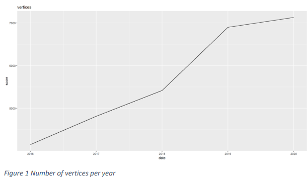

Secondly, we calculate the number of edges. The number of edges increases each year, see figure 2, as
more authors write papers and so the collaborations between them increase. The fluctuation becomes
more intense from year 2018 to year 2019.


```python
plot2 <- ggplot(edges, aes(x=date, y=score)) + geom_line()+ggtitle("edges")                                  
```

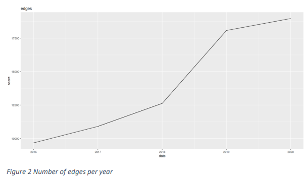

Thirdly, we calculate the diameters. Year 2017 has the shortest distance between the two most distant
nodes while year 2018 the longest, see figure 3. There is significant fluctuation in all years. 


```python
plot3 <- ggplot(diameter, aes(x=date, y=score)) + geom_line()+ggtitle("diameter")                                  
```

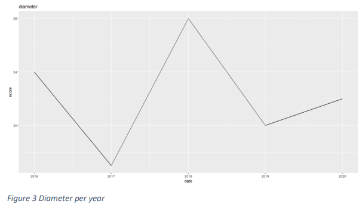

Finally, we calculate the average degree. Year 2020 has the highest average number of edges per node
while year 2017 the lowest, see figure 4. Although a decrease is observed from year 2016 to year 2017, a
steady increase is observed in the next years leading to new highs.


```python
plot4 <- ggplot(mean_degree, aes(x=date, y=score)) + geom_line()+ggtitle("mean_degree") 
```

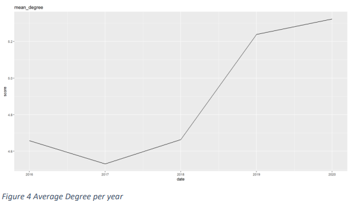

### Important Nodes

The scope is to find the 10 most important nodes based on degree and page rank.
Based on degree, the highest degree is observed in 2018 equal to 70 and the lowest in 2016 and 2018
equal to 25. The top-10 changes a lot each year, but the top 3 authors mostly remain the same with “Hui
Xiong 0001”, “Jiawei Han 0001” and “Philip S. Yu” to participate every year.
Based on page rank, the highest page rank is observed in 2018 equal to 0.0019 and the lowest in 2018
again equal to 0.00061. The top-10 changes a lot each year, but the top 3 authors mostly remain the
same with “Hui Xiong 0001”, “Jiawei Han 0001” and “Philip S. Yu” to participate almost every year.
Based on degree the most important nodes are:


```python
#Top-10 authors by degree
data.frame(total_degree=tail(sort(degree(graph2016, v = V(graph2016), mode = c("all"),
                                          loops = FALSE,normalized=FALSE)),10))
data.frame(total_degree=tail(sort(degree(graph2017, v = V(graph2017), mode = c("in"),
                                          loops = FALSE)),10))
data.frame(total_degree=tail(sort(degree(graph2018, v = V(graph2018), mode = c("in"),
                                          loops = FALSE)),10))
data.frame(total_degree=tail(sort(degree(graph2019, v = V(graph2019), mode = c("in"),
                                          loops = FALSE)),10))
data.frame(total_degree=tail(sort(degree(graph2020, v = V(graph2020), mode = c("in"),
                                          loops = FALSE)),10))

#top-10 authors by page rank
rank2016<-page_rank(graph2016, algo = "prpack",
                 vids = V(graph2016), directed = TRUE, damping = 0.85,
                 personalized = NULL, weights = E(graph2016)$weight)
rank2017<-page_rank(graph2017, algo = "prpack",
                 vids = V(graph2017), directed = TRUE, damping = 0.85,
                 personalized = NULL, weights = E(graph2017)$weight)
rank2018<-page_rank(graph2018, algo = "prpack",
                 vids = V(graph2018), directed = TRUE, damping = 0.85,
                 personalized = NULL, weights = E(graph2018)$weight)
rank2019<-page_rank(graph2019, algo = "prpack",
                 vids = V(graph2019), directed = TRUE, damping = 0.85,
                 personalized = NULL, weights = E(graph2019)$weight)
rank2020<-page_rank(graph2020, algo = "prpack",
                 vids = V(graph2020), directed = TRUE, damping = 0.85,
                 personalized = NULL, weights = E(graph2020)$weight)

data.frame(Rank_2016=tail(sort(rank2016$vector),10))
data.frame(Rank_2017=tail(sort(rank2017$vector),10))
data.frame(Rank_2018=tail(sort(rank2018$vector),10))
data.frame(Rank_2019=tail(sort(rank2019$vector),10))
data.frame(Rank_2020=tail(sort(rank2020$vector),10))
```

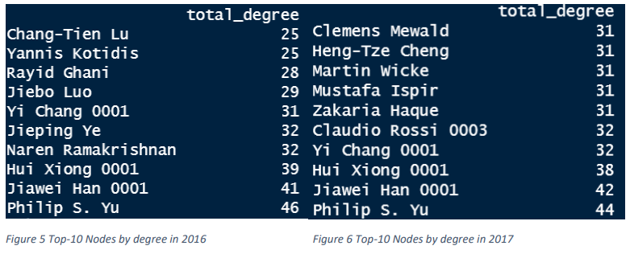

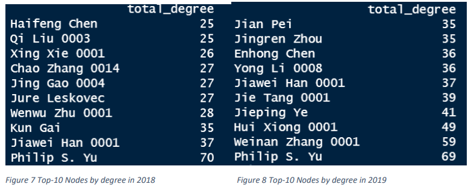

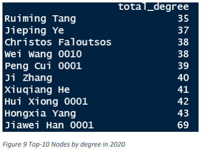

Based on page rank the most important nodes are:


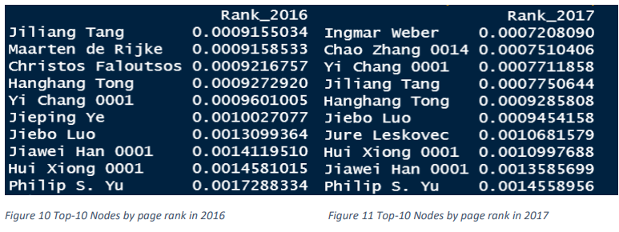

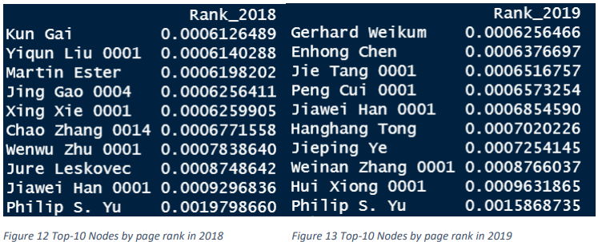

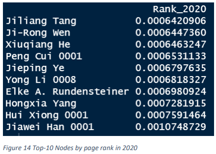

### Communities

We use the algorithms greedy clustering, infomap clustering and Louvain clustering to detect the
communities of each year. All the methods return results while infomap was a lot slower than the other
2 methods as it took 5.5 secs to run while the others 0.1 secs both.
We choose “Jiawei Han 0001” as an author that presents in all years and the Louvain method that we
used before. The size of the community increases from 2016 to 2017 reaching 121 nodes, then drops in
2018 and 2019 to 86 and 69 Nodes respectively, to finally increase and reach a maximum for the 5 years
equal to 124 Nodes. Comparing the similarity of nodes of each year to its forthcoming year, 2016 and
2017 have 14 similar nodes, 2017 and 2018 have 15 similar nodes, 2018 and 2019 have 25 similar nodes
and 2019 and 2020 have 14 similar nodes.
Finally, we plot the communities recognized by the Louvain algorithm for each year and for a different
color for each community in plots 15,16,17,18,19. For visualization reasons, we filter out communities
with extreme sizes compared to the rest of the year.


```python
#convert the graphs to undirected
graph2016_undirected <- as.undirected(graph2016)
graph2017_undirected <- as.undirected(graph2017)
graph2018_undirected <- as.undirected(graph2018)
graph2019_undirected <- as.undirected(graph2019)
graph2020_undirected <- as.undirected(graph2020)
graphs_undirected <- list(graph2016_undirected,graph2017_undirected,graph2018_undirected,
                          graph2019_undirected,graph2020_undirected)
#Greedy Clustering and time performance
system.time(greedy <- sapply(graphs_undirected,cluster_fast_greedy))
#Infomap Clustering and time performance
system.time(infomap <- sapply(graphs_undirected,cluster_infomap))
#Louvain Clustering and time performance
system.time(louvain <- sapply(graphs_undirected,cluster_louvain))
            
#find 1 author that exists in all years  and compare him for all years
#First find the index of the community the author participates in each year
membership(louvain[[1]])["Jiawei Han 0001"]
membership(louvain[[2]])["Jiawei Han 0001"]
membership(louvain[[3]])["Jiawei Han 0001"]
membership(louvain[[4]])["Jiawei Han 0001"]
membership(louvain[[5]])["Jiawei Han 0001"]

#check the size of the community the author belongs to each year
length(louvain[[1]][[37]])
length(louvain[[2]][[15]])
length(louvain[[3]][[76]])
length(louvain[[4]][[52]])
length(louvain[[5]][[7]])

#find similar nodes of each year to its next year
sum(louvain[[1]][[37]] %in% louvain[[2]][[15]])
sum(louvain[[2]][[15]] %in% louvain[[3]][[76]])
sum(louvain[[3]][[76]] %in% louvain[[4]][[52]])
sum(louvain[[4]][[52]] %in% louvain[[5]][[7]])
sum(louvain[[1]][[37]] %in% louvain[[2]][[15]])

#plot communities
#check the size of each community
louvain_clusters <- list(louvain[[1]],louvain[[2]],louvain[[3]],louvain[[4]],louvain[[5]])
size <- sapply(louvain_clusters,sizes)

#filter out nodes of large communities 
sub2016<-unlist(louvain[[1]][size[[1]] > 50])
plot2016 <- induced.subgraph(graph2016, sub2016)

sub2017<-unlist(louvain[[2]][size[[2]] > 70])
plot2017 <- induced.subgraph(graph2017, sub2017)

sub2018<-unlist(louvain[[3]][size[[3]] > 70])
plot2018 <- induced.subgraph(graph2018, sub2018)

sub2019<-unlist(louvain[[4]][size[[4]] > 50])
plot2019 <- induced.subgraph(graph2019, sub2019)

sub2020<-unlist(louvain[[5]][size[[5]] > 100])
plot2020 <- induced.subgraph(graph2020, sub2020)

#change color of each community
V(plot2016)$color <- factor(membership(louvain[[1]]))
V(plot2017)$color <- factor(membership(louvain[[2]]))
V(plot2018)$color <- factor(membership(louvain[[3]]))
V(plot2019)$color <- factor(membership(louvain[[4]]))
V(plot2020)$color <- factor(membership(louvain[[5]]))

#plot communities of each year with different colors
plot(plot2016, vertex.label = NA, vertex.size = 3, main='Communities 2016')
plot(plot2017, vertex.label = NA, vertex.size = 3, main='Communities 2017')
plot(plot2018, vertex.label = NA, vertex.size = 3, main='Communities 2018')
plot(plot2019, vertex.label = NA, vertex.size = 3, main='Communities 2019')
plot(plot2020, vertex.label = NA, vertex.size = 3, main='Communities 2020')

```

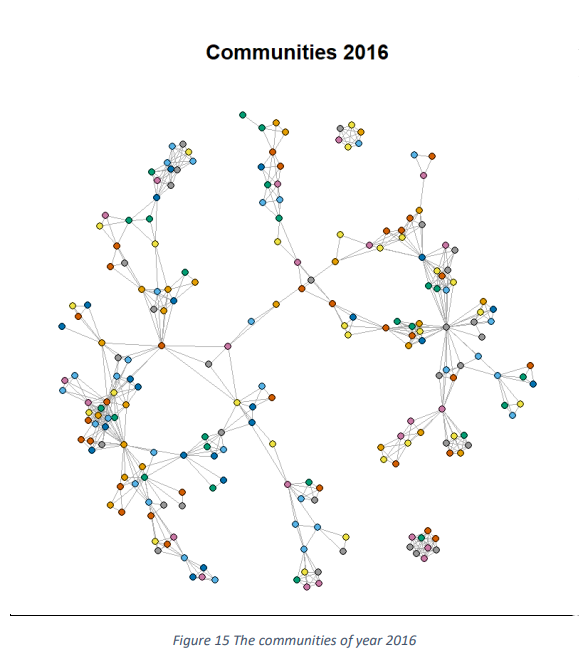

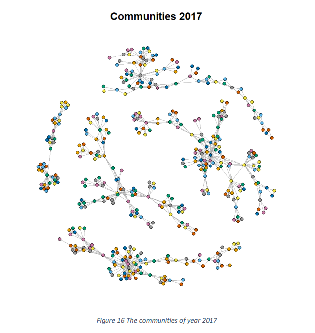

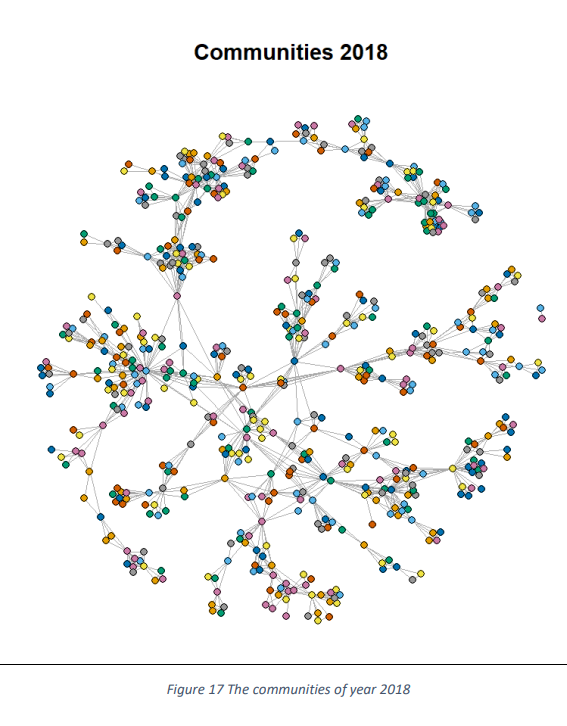

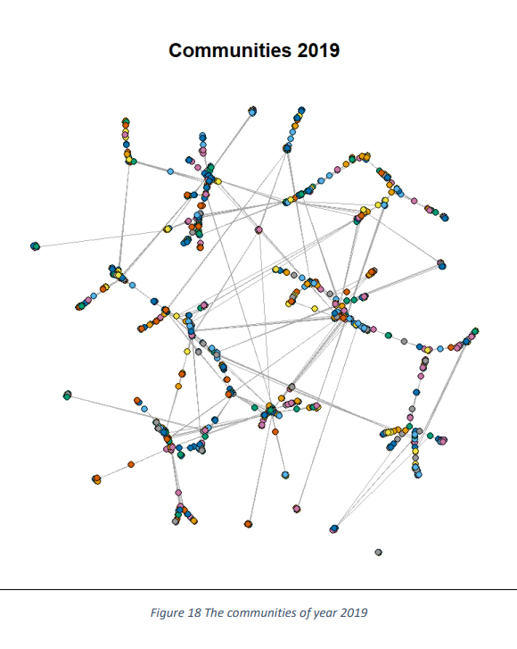
