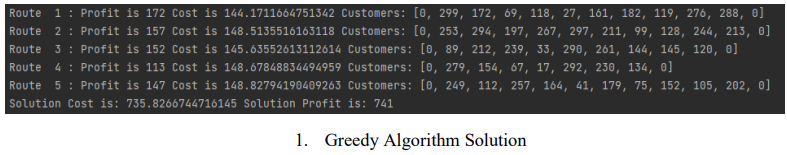
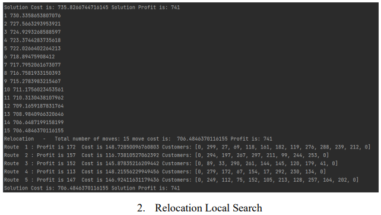
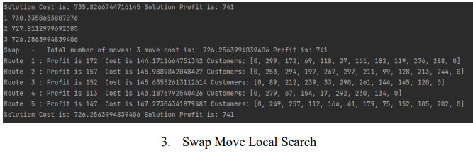
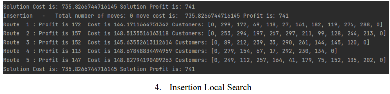
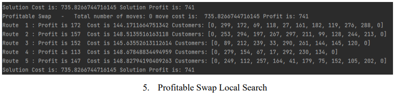
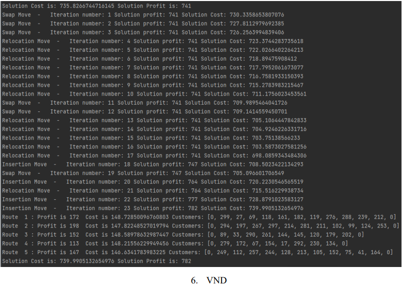
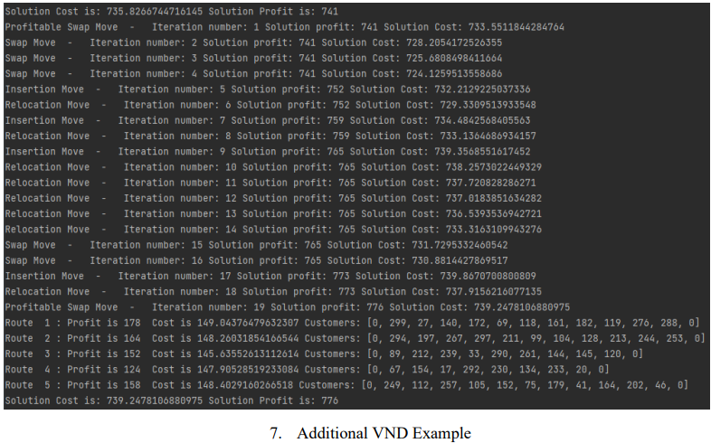

### Problem Description

Consider a central repository (Node with id: 0) and a set of n = 300 customers (Nodes with id: 1,..,n=300). All nodes are in a square of side size-100. The transition time from node to node is equal to the Euclidean distance between two nodes. Each customer has a required service time and a profit. A fleet of 5 vehicles is located in the central warehouse. The vehicles start from the warehouse, serve the customers and return to the central warehouse. Each vehicle conducts one route. Each customer must be covered (not necessarily) by a single vehicle visit. In this case, the customer bestows their profit to the route. The total
time of each route cannot exceed 150 time units. The scope of the problem is to design a 5-route schedule that maximizes the total profit.

### Model Structure

The solution of the problem presented, was reached through object-oriented programming. Initially, several classes in Python were constructed. The base of the solution was the class ‘Model’, which contained all the customers, the distance between the customers and a profit per cost ratio matrix for all customers (it is calculated by dividing the profit with the service time and the distance between two nodes). The profit for each customer is a random number between 5 and 20, while the service time for each customer is a random number between 5 and 10 time units. Each node (customer) has a random longitude and latitude
(numbers between 0-100), an ID number, a service time, a profit and an index that shows whether the customer has been serviced. The warehouse is located in the coordinates (50,50). Finally, a class has been created for the routes of the fleet of the vehicles. Each vehicle has a sequence of nodes (customers), starting from the warehouse, a capacity, a cost and a profit. Finally, to ensure consistent results, a random seed was used.

### Greedy Solution

The first step for the construction of the greedy algorithm, was the creation of a ‘Solver’ class. The ‘Solver’ class contains information for all the nodes, the customers, the distance matrix, profit ratio, the time capacity constraint, an empty solution and a class that initializes a nearest neighbor solution algorithm. The algorithm inspects all the customers (nodes) that can fit (considering that the vehicle must return to the warehouse) in the open routes, selects the one with the greatest value in the profit matrix and stores them and their best route. Upon inspecting all the customers, the warehouse is inserted at the last position of each route and the cost is updated with the time spend to travel from the last customer of each route to the
warehouse.

### Local Searches

Local searches are procedures that iteratively transition from one solution to another via specific modifications to the current solution structure. Four such procedures were constructed, each one performing different modifications to the current solution. For each procedure a clone solution of the initial greedy solution was stored to compare its results with those of the best neighbor solution. If the candidate solution proves to be better than the clone solution, it replaces the clone solution. The local search examines the neighborhood of the new clone solution until it reaches a local minimum (or maximum). Finally, for each local search, the total number of iterations, the type of local search performed, the new cost, the new profit,
and the new routes are printed.

The first local search performed is ‘Relocation’. The aim of this local search is to minimize the solution’s total cost by relocating covered customers from their current position in the route to another (this is not limited to the route of the vehicle that currently serves the customer but all the possible routes that can feasibly serve him). It is observed that the relocation local search iterated 15 times, the profit remained constant (as expected) and the total cost dropped approximately by 29 (from 735 to 706) time units.

The second local search performed is ‘Swap’. The aim of this local search is to minimize the solution’s total cost by swapping the position of any pair of covered customers (in the same or different routes), while not violating the capacity constraint for each vehicle examined. It is noticed that only 3 iterations were performed with this local search, the profit remains constant (as expected) and the solution’s total cost dropped approximately by 9 (from 735 to 726) time units.

The third local search performed is the ‘Insertion’. The aim of this local search is to maximize the profit per cost ratio of the solution by examining all the possible insertion positions in the current solution for all uncovered customers. The customer selected is the one with the best profit to cost ratio that does not violate the capacity constraint of the route they will be inserted to. It is noticed that this local search method was unable to locate any better neighbor solution. As a result, the solution’s cost and profit remain constant.

The final local search performed is the ‘Profitable Swap’. The aim of this local search is to maximize the profit per cost ratio of the solution by replacing any covered customer in the current solution with any uncovered customer. For each possible swap the time constraint for each vehicle is taken into consideration. It is observed that this local search also failed to locate any better neighbor solution. Hence, the solution’s cost and profit also remain unchanged.

### Variable Neighborhood Descent - VND

Variable Neighborhood Descent is an algorithmic framework for solving combinatorial optimization problems. The main idea is the systematic change of the move types (e.g., Relocation, Swap, Insertion, Profitable Swap) during the search in the solution space. VND in particular searches the solution space in a deterministic way. All possible permutations of the above move types were tested and the optimal permutation is the following:

1. Swap

2. Relocation

3. Insertion

4. Profitable Swap

This specific permutation of local searches leads to 23 applications of the mentioned move types that result to an increase of the solution’s total time by almost 4 time units and to an increase of the solution’s profit by 41 profit units. For exhibition purposes, an additional example of a VND application is provided that utilizes all the local searches that have been created (table 7).

