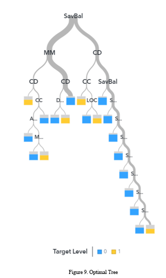
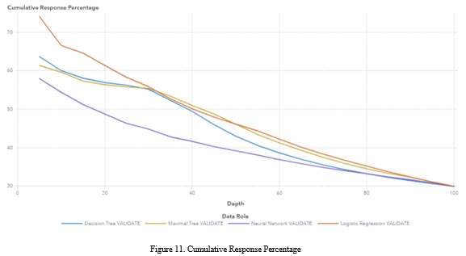

### Case Study 1

### Executive Summary

The scope of the report is to exploit cross selling opportunities for the Buy-books-on-line.com site, that sells books about science and information technology. The category of books that is of particular interest due to its popularity are the books related to “Business Analytics”. To identify those opportunities, a Market Basket Analysis was performed based on 19.805 past sales transactions. Before the implementation of the analysis a figure was constructed that presents the number of book sales by book title in order to recognize the titles with the highest and the lowest number of sales.  For the Market Basket Analysis, the idea is to identify the highest purchasing probability of a product or group of products, given that a product or group of products have already been bought or searched by a customer. The analysis focused on two different parts. The first part is related to 4 specific books (‘Managerial Analytic’, ‘Implementing Analytics’, ‘Customer Analytics for Dummies’, ‘Enterprise Analytics’) and their strongest relationships. For the ‘Managerial Analytics’ book, the two books that should be advertised are the ‘Implementing Analytics’ and ‘Web Analytics 2.0’. For the ‘Implementing Analytics’ book, the two books that should be advertised are the ‘Data Science and Big Data Analytics’ and ‘Managerial Analytics’. For the ‘Customer Analytics for Dummies’ book, the two books that should be advertised are the ‘Decision Analytics’ and ‘Enterprise Analytics’. Finally, for the ‘Enterprise Analytics’ book, the two books that should be advertised are the ‘Customer Analytics for Dummies’ and ‘Managerial Analytics’. The second part identifies the set of 3 books that have been purchased together by the customers the highest number of times. These books are the ‘Business Analytics for Managers’, the ‘Data Analytics Made Accessible’ and ‘Data Science and Business Analytics’.

### Technical Analysis

The purpose of this report is to exploit potential selling opportunities for the sales department of the online store Buy-books-on-line.com, with the target to sell as many books as possible. In order for this to be achieved a Market Basket Analysis method was conducted based on past sales transactions of 1,896 customers that have bought at least one book that belongs to the ‘Business Analytics’ category, this category includes 56 books such as ‘Credit Risk Analytics’ and ‘Analytics at Work’.
Market Basket Analysis is a popular data mining technique that is widely used by retailers to increase sales by better understanding customer purchasing patterns. In the simplest situation the data for Market Basket Analysis consists of two variables: a transaction and an item. For this case study, the transaction variable is the customer id, meaning that this client made a transaction for a certain item, while the item variable is the name of the book that was purchased. A core concept of Market Basket Analysis is the association rule. Association rules count the frequency of items that occur together, seeking to find associations that occur far more often than expected. The analysis aims to determine the strength of all the association rules among the set of items and help retailers to improve their business decisions. 
To implement this Market Basket Analysis method, firstly a relational table with two columns was created. The table had one column that contained the customer id and another column that contained the book that was purchased from the particular customer. A metric called lift determines the strength of each association rule. This metric is calculated as the division of confidence to expected confidence. The confidence of each association rule is calculated as the conditional probability of purchasing one item or group of items (e.g., item A), given that another item or group of items has been purchased (e.g., item B). While the expected confidence metric is calculated as the conditional probability of the second item or group of items being purchased (e.g., item B) given that the first item or group of items has been purchased (e.g., item A). The final metric that is used for a Market Basket Analysis is called support and its calculated as the probability of intersection between a purchased item or group of items and the other purchased item or group of items (e.g., P(A∩B)).
Therefore, for our analysis we calculate the metrics mentioned above (Support, Confidence, Expected Confidence and Lift) to understand the associations between the books. Due to the high number of possible associations between products and the need to find the strongest relationships, some constraints were implemented. The association rules were calculated only for rules that had a minimum level of support greater than or equal to 5%, minimum confidence greater than or equal to 10% and a minimum lift greater than or equal to 1. Finally, the maximum number of books that could be contained in each association rule was limited to 3 (e.g., ‘Applied Business Analytics, Analytics in a Big Data World -> Google Analytics in Pictures’).

**2.** In figure 1 the number of book units sold by book title is presented. It can be observed that the book ‘Data Science and Business Analytics’ is the one with the highest number of units sold. While the book ‘Managerial Analytics’ seems to have the lowest number of units sold.

**3.** The store seeks to find the two books that should be advertised to customers who bought or are searching to buy four particular books (Managerial Analytics, Implementing Analytics, Customer Analytics for Dummies and Enterprise Analytics). To identify the books that should be advertised, we sorted the lift column in descending order. Then, for each of the four books that are of interest, we filtered the Market Basket Analysis table for association rules that contained on the left side only the book that was of interest. Therefore, we identified the books that the store should advertise in each distinct case. For the ‘Managerial Analytics’ book, the two books that should be advertised due to the highest lift, are the ‘Implementing Analytics’ and ‘Web Analytics 2.0’. For the ‘Implementing Analytics’ book, the two books that should be advertised due to the highest lift, are the ‘Data Science and Big Data Analytics’ and ‘Managerial Analytics’. For the ‘Customer Analytics for Dummies’ book, the two books that should be advertised due to the highest lift, are the ‘Decision Analytics’ and ‘Enterprise Analytics’. Finally, for the ‘Enterprise Analytics’ book, the two books that should be advertised due to the highest lift, are the ‘Customer Analytics for Dummies’ and ‘Managerial Analytics’. The association rule with the highest lift with three (3) items where each of the above-mentioned book is on the left side, is the rule where on the left side is the ‘Managerial Analytics’ book and on the right side are the ‘Implementing Analytics’ and ‘Web Analytics 2.0’ books. This means that if a customer has bought the ‘Managerial Analytics’ book, then it is 11.472 times more probable to buy the ‘Implementing Analytics’ and ‘Web Analytics 2.0’ books, compared to a random customer that has not bought the ‘Managerial Analytics’ book. 

If the maximum number of items in a rule are set to 3, the 3 books that are most often bought together are the ‘Business Analytics for Managers’, the ‘Data Analytics Made Accessible’ and ‘Data Science and Business Analytics’. These set of books is found together 794 times. These mean that those books have been bought together by customers 794 times. The support metric for this set of books is equal to 41.877. The support metric is calculated as the probability of intersections of those 3 books, which is translated as the number of times these books have been bought together by customers divided by the total number times the customers have made a purchase of books in the online store during the study period. 

### Case Study 2

### Executive Summary

The online retailer Sports-OnLine.com, is an online retailer that sells sports clothes and shoes, that wants to exploit the electronic data captured during the previous years of operation to better understand the market. To do so, an RFM analysis was conducted, to divide the customer base into subsets that share similar characteristics based on three key factors (Recency, Frequency, Monetary). Recency refers to how recently a customer has transacted with a retailer. Frequency refers to how frequently a customer has engaged with a retailer. While Monetary refers to how much money a customer has spent on a retailer products and services. As a result of the RFM analysis four (4) customer groups were identified. The first customers group was labeled ‘Lost Customers’, as it refers to customers, that on average, compared to the average customer from the whole customer base, have not purchased a product for a longer period of time, they purchased products less frequently and the total amount they had spent is lower. The second customers group was labeled ‘First Timers’, as it refers to customers, that on average, compared to the average customer from the whole customer base, have purchased a product more recently, they purchased products less frequently and the total amount they had spent is lower. The third customers group was labeled ‘Churners’, as it refers to customers, that on average, compared to the average customer from the whole customer base, have not purchased a product for a longer period of time, they purchased products more frequently and the total amount they had spent is higher. The fourth customers group was labeled ‘Churners’, as it refers to customers, that on average, compared to the average customer from the whole customer base, have purchased a product more recently, they purchased products more frequently and the total amount they had spent is higher. Based on the above customer groups several strategies were proposed that include customer feedbacks, improvement of services, sales, personalized offers and loyalty products that will offer additional rewards.

### Technical Analysis

The online retailer Sports-OnLine.com, is an online retailer that sells sports clothes and shoes that wants to exploit the electronic data captured during the previous years of operation to better understand the market. To do so, it was decided that a customer segmentation analysis based on the Recency Frequency Monetary (RFM) technique should be followed. RFM analysis is a way to use available data derived from existing customer behavior to divide the market into subsets that share similar characteristics based on three key factors (Recency, Frequency, Monetary). Recency refers to how recently a customer has transacted with a retailer. Frequency refers to how frequently a customer has engaged with a retailer. While Monetary refers to how much money a customer has spent on a retailer products and services. The target of the analysis is to enable a brand or a retailer to increase revenues by targeting specific groups of existing customers with messages and offers that are more likely to be relevant based on data about a particular set of behaviors. 

Taking into consideration the above a dataset that contained the information about the identification (id), recency, frequency and monetary for each customer was created. During the explanatory data analysis of the dataset, it was observed that a number of outliers were present. Therefore, it was deemed necessary to filter those extreme value by excluding values that deviated more than three standard deviations from the mean. Additionally, it was observed that some variables were exhibiting signs of asymmetry in their distribution. Hence, it was considered essential to transform the variables values using the logarithm to solve this problem. With the preparatory steps completed the final dataset was used for the RFM analysis. The clustering that was performed (using k-means and Euclidean distance) identified 4 different groups of customers.
Based on the characteristics of those clusters, that are presented in table 1 and figure 2, a name was assigned to each one of them. The first cluster was named ‘Lost Customers’ and has 205 customers corresponding to 20.9% of the total customer base. The average representative customer of the first cluster has not purchased a product for the last 15.7 months, has purchased on average 2.3 times from the store and has an average total of purchases of 196.62€. This means that the total purchases from customers of the first cluster are equal to 40,308€ which represents 8.9% of the total amount spend for purchases in the store during the study period. Compared to the average customer from the whole customer base, it can be said that the representative customer from the first cluster, has not purchased a product for a longer period of time compared to the average customer from the whole customer base. Additionally, it can be said the representative customer from the first cluster, purchases products less frequently compared to the average customer from the whole customer base. Finally, it can be said that the representative customer from the first cluster, spends less money for the purchases of products compared to the average customer from the whole customer base.

The second cluster was named ‘First Timers’ and has 257 customers corresponding to 26.3% of the total customer base. The average representative customer of the second cluster has not purchased a product for the last 5.2 months, has purchased on average 4.1 times from the store and has an average total of purchases of 352.29€. This means that the total purchases from customers of the second cluster are equal to 90,541€ which represents 20.0% of the total amount spend for purchases in the store during the study period.  Compared to the average customer from the whole customer base, it can be said that the representative customer from the second cluster, has purchased a product more recently compared to the average customer from the whole customer base. Additionally, it can be said the representative customer from the second cluster, purchases products less frequently compared to the average customer from the whole customer base. Finally, it can be said that the representative customer from the second cluster, spends less money for the purchases of products compared to the average customer from the whole customer base.
The third cluster was named ‘Churners’ and has 300 customers corresponding to 30.6% of the total customer base. The average representative customer of the third cluster has not purchased a product for the last 13.8 months, has purchased on average 5.53 times from the store and has an average total of purchases of 552.87€. This means that the total purchases from customers of the third cluster are equal to 165,861€ which represents 36.7% of the total amount spend for purchases in the store during the study period.  Compared to the average customer from the whole customer base, it can be said that the representative customer from the third cluster, has not purchased a product for a longer period of time compared to the average customer from the whole customer base. Additionally, it can be said the representative customer from the third cluster, purchases products more frequently compared to the average customer from the whole customer base. Finally, it can be said that the representative customer from the third cluster, spends more money for the purchases of products compared to the average customer from the whole customer base.
The fourth cluster was named ‘Best’ and has 217 customers corresponding to 22.2% of the total customer base. The average representative customer of the fourth cluster has not purchased a product for the last 4.2 months, has purchased on average 7.2 times from the store and has an average total of purchases of 715.13€. This means that the total purchases from customers of the fourth cluster are equal to 155,185€ which represents 34.3% of the total amount spend for purchases in the store during the study period.  Compared to the average customer from the whole customer base, it can be said that the representative customer from the fourth cluster, has purchased a product more recently compared to the average customer from the whole customer base. Additionally, it can be said the representative customer from the fourth cluster, purchases products more frequently compared to the average customer from the whole customer base. Finally, it can be said that the representative customer from the fourth cluster, spends more money for the purchases of products compared to the average customer from the whole customer base.

Considering the results from the RFM analysis some strategies can be proposed to be enacted in each customer segment in order to achieve the desired results. For the cluster of the ‘Lost Customers’, the proposed strategy to be followed, is to firstly contact the customers for feedback to try to understand the reasons that caused them to lessen the engagement with the company, and then to give them incentives to reengage with the company. For the cluster of the ‘First Timers’, the proposed strategy revolves around offering enticing deals and promotions so as to keep the new customers as active as possible. For the cluster of the ‘Churners’, the proposed strategy aims to use a reactivation program for those customers, in order to avoid losing them through personalized emails and other targeted adds that will recommend products based on their past purchases with beneficial new offers that will be on sale. For the cluster of the ‘Best’, the proposed strategy aims to keep the best customer customers of the store as satisfied as possible by offering them loyalty programs that will reward them for their continued engagement with the company.

### Case Study 3

### Executive Summary

The marketing department of the insurance organization – XYZ, is organizing a targeting campaign to identify segments of customers who are likely to purchase a variable annuit. The scope of the report is to create a machine learning based customer response model that predicts whether a customer will purchase the insurance product or not if s/he is solicited. To gather the necessary data for the construction of the model the organization approached a sample of its customers (30,129), to whom they promoted the insurance product by soliciting them in a variety of ways this year. The collected dataset contains 47 customer’s characteristics. The first stage of the report was to conduct an Explanatory Data Analysis, to understand the available data. It was identified that around 70% of the solicited customers did not purchase the promoted product, while 30% of them purchased it, with the customers that purchased it having on average a higher deposited amount in their accounts. At the second stage of the report, four different models were constructed (Optimal Tree, Maximal Tree, Logistic Regression and Neural Networks). The best model, as was identified based on several metrics and graphs that account for its ability to correctly classify new customers, is the Logistic Regression Model. To validate the results, the best model was applied to an external dataset with 3,013 new customers. The model classified 1,746 as potential buyers and 1,247 as potential non-buyers, with the most important characteristics being if the customer has a certificate of deposit, if the customer has a saving account, the saving balance amount that the customer has and if the customer has a money market account.

**2.** The constructed profit matrix considers all the possible outcomes based on the actions off the insurance company ‘XZY’, and the reactions of the customers, that can occur in the marketing campaign. The point of interest for the company concerns the monetary result of each action it takes depending on the customer reply, with the aim being to maximize its return on investment (ROI). Therefore, the cells contain the monetary result calculated as the difference between the income and cost of each possible scenario. For the first scenario where the company ignored a customer, and didn’t solicit him/her, the monetary result for this action would be zero, since the cost of not solicit him/her would be zero while the income for the company would also be zero regardless of the action of the customer. For the second scenario, where the company contacts the customer, two possible monetary results emerge depending on the answer of the customer. In the first case, if the customer responds positively to the promotion offer, the monetary result would be a profit of 800€ (1100 - 300), with the cost of solicitation being 300€, while the assumption of the income being 1100€, based on historical data. In the second case, if the customer does not respond to the promotion offer, the monetary result would be a loss of 300€ (0 - 300), with the cost of solicitation being 300€, while the assumption of income being 0€.

**3.** To calculate the minimum probability that a customer should have as to be considered a buyer and hence for solicitation, the expected profit if the company solicits the customer and the expected profit if the company ignores the customer needs to be calculated. Then by solving the system of the two and finding the probability that a customer will respond (p1), the cut-off point for solicitation can be calculated. The calculations are presented below.

As a result, the minimum probability that a customer should have to respond positively to the solicitation is 0.272 or 27.2%.

**4.** With the cut-off point calculated the next step is to partition the available dataset, to two subsets. The first subset will be used to train the model and contains 70% of the total observations of the data set, while the second subset contains 30% of the total observations and will be used to test the model. This process is necessary to be performed to be able to evaluate the performance of the model in an out of sample way, with data that the algorithm has not been trained on. The reason for this need is to be able to avoid the problem of overfitting which causes the machine learning algorithm to perform really good on the data that it has been trained on while on the other hand performing poorly on other data and real-world situations. Additionally, to ensure that subgroups (strata) of the given dataset are each adequately represented within the whole sample population of each subset created (train & test), a stratification sampling technique is used. 

**5.** In Table 2 it is presented the number of missing values in each variable in the dataset. As it can be seen, there are no such values in the available dataset.

Additionally, the proportion of buyers and non-buyers is presented in figure 4, where it can be observed that the buyers account for 30% of the total customers in the database (9,039 customers). While the non-buyers account for the 70% of the total customers in the database (21,089 customers).

**6.** If the proportions of the dataset were 10% buyers and 90% non-buyers, this would mean that the dataset would be imbalanced. Imbalanced datasets tend to pose a challenge for predictive modeling as most of the machine learning algorithms used for classification were designed around the assumption of an equal number of examples for each class. This results in models that have poor predictive performance, specifically for the minority class. Therefore, it would be necessary to perform a rebalancing of the proportions of each category (buyers – non-buyers), by selecting all the observations with the minority class (buyers) and selecting a subset of the majority class (non-buyers) to end up with a dataset which would contain 30% of buyers and 70% of non-buyers.

**7.** In figure 5 the proportions of buyers and non-buyers for those customers that have purchased 5 or more times credit cards are presented. It was observed that no customer has purchased a credit card more than 5 times, therefore, the graph includes customers that have purchased a credit card 5 times. Additionally, it is observed that only two customers have purchased credit cards 5 times and both of those customers purchased the promoted insurance product.

**8.** In figure 6 the average deposit amount for buyers and non-buyers is presented. It can be observed that the customers that purchased the promoted product (buyers), have on average a higher deposited amount in their accounts compared to customers that did not purchase the promoted product (non-buyers). It is important to note that the difference between the two categories of customers is not insignificant and seems to reveal a pattern concerning the target variable. The customers with higher deposited amounts in their account are more likely to purchase the promoted product compared to customers with lower deposited amounts in their account.

**9.** A Decision Tree node was constructed and connected to the data source node. The variable that was used for the first split is Saving Balance. The reason for the selection of the variable saving balance, is because it had the split with the highest quality, with the quality of the split being calculated by the reported logworth. Therefore, the variable that is selected in each split has the highest logworth. In the first split the customers that have a saving balance greater than or equal to 88.869€ are directed to the right node (number of customers, 8014), while the customers that have a saving balance less than 88.869€ or the saving balance is missing are directed to the left node (number of customers, 13075).

**10.** The maximal tree, which is the tree with the highest number of terminal leaves is called ‘Maximal Tree’. In this case, the ‘Maximal Tree’ has 124 terminal leaves. The constructed maximal tree is presented in figure 7.

An interesting phenomenon is observed in figure 8, where the Misclassification Rate of the ‘Maximal Tree’ in the train and test datasets is presented. As it can be seen, the Misclassification Rate in the training dataset keeps decreasing with the ‘Maximal Tree’ being selected at the lowest Misclassification Rate. On the other hand, in the test dataset, which the constructed tree has not seen before, the performance of the algorithm firstly steadies for a bit and then deteriorates after a certain number of leaves is selected. The phenomenon is known as overfitting and is caused when the model fits too well in the training data but fails to explain the variance of data that has not been previously seen by the model. This phenomenon may cause severe problems in real world applications, and it is advised to be on alert for models that end up overfitting in their training data.

**11.** The optimal decision tree that was constructed is presented in figure 9 and has 20 terminal leaves. 

Additionally, the Misclassification Rate of the optimal tree for the train and test dataset is presented in figure 10. As it can be observed, the optimal tree is selected when the Misclassification Rate for the test dataset is at its lowest value. After that point the Misclassification Rate seems to increase, which indicates that model is starting to overfit. 

**12.** The decision tree model is defined by three characteristics. The first one is the posterior probability, that defines the probability for the observations that are included in the bracket to be part of each category. The second one is the final decision which indicates in which category the observations are classified. The final characteristic is the rules, that defines the threshold on which each Node performs its split until the Terminal Leaf is reached. 

**13.** The interpretation of the decision tree for non-technical people would be different compared to the previous question. Therefore, it can be said that if a customer has less than 88.869€ in his saving balance account or this information is missing and he has a money market account and he has a certificate of deposit, then the probability that he will purchase a variable annuity is 60.78%, while the probability that he will not purchase a variable annuity is 39.22%. Hence, according to the threshold that has been defined, this customer will purchase a variable annuity.

The second example that would be presented is that if a customer has less than 88.869€ in his saving balance account or this information is missing, and he has not a money market account and he has not a certificate of deposit, then the probability that he will purchase a variable annuity is 17.87%, while the probability that he will not purchase a variable annuity is 82.13%. Hence, according to the threshold that has been defined, this customer will not purchase a variable annuity.

The third example that would be presented is that if a customer has more than or equal to 88.869€ in his saving balance account, and he has a certificate of deposit and he has a credit card, then the probability that he will purchase a variable annuity is 67.87%, while the probability that he will not purchase a variable annuity is 32.13%. Hence, according to the threshold that has been defined, this customer will purchase a variable annuity.

The fourth example that would be presented is that if a customer has more than or equal to 88.869€ in his saving balance account, and he has not a certificate of deposit and he has less than or 166.142€ in his saving balance account or this information is missing, then the probability that he will purchase a variable annuity is 14.90%, while the probability that he will not purchase a variable annuity is 85.10%. Hence, according to the threshold that has been defined, this customer will not purchase a variable annuity.

The final example that would be presented is that if a customer has less than 88.869€ in his saving balance account or this information is missing, and he has not a money market account and he has a certificate of deposit and he has not a checking account, then the probability that he will purchase a variable annuity is 62.54%, while the probability that he will not purchase a variable annuity is 37.46%. Hence, according to the threshold that has been defined, this customer will purchase a variable annuity.

**14.** In figure 11, the cumulative % response graph for the four constructed models is presented. As it can be seen, if we promote the variable annuity to the 20% of the best customers according to the probability that the Optimal Tree model gives them to purchase the product, the 56.941% of this 20% percent will purchase the variable annuity product. Additionally, if we promote the variable annuity to the 100% of the best customers according to the probability that the Optimal Tree model gives them to purchase the product, the 30% of this 100% percent will purchase the variable annuity product.

As it can be observed, if we promote the variable annuity to the 20% of the best customers according to the probability that the Logistic Regression model gives them to purchase the product, the 61.394% of this 20% percent will purchase the variable annuity product. Additionally, if we promote the variable annuity to the 100% of the best customers according to the probability that the Logistic Regression model gives them to purchase the product, the 30% of this 100% percent will purchase the variable annuity product.

As it can be seen, if we promote the variable annuity to the 20% of the best customers according to the probability that the Maximal Tree model gives them to purchase the product, the 56.38% of this 20% percent will purchase the variable annuity product. Additionally, if we promote the variable annuity to the 100% of the best customers according to the probability that the Maximal Tree model gives them to purchase the product, the 30% of this 100% percent will purchase the variable annuity product.

For the final model it can be observed, that if we promote the variable annuity to the 20% of the best customers according to the probability that the Neural Network model gives them to purchase the product, the 48.783% of this 20% percent will purchase the variable annuity product. Additionally, if we promote the variable annuity to the 100% of the best customers according to the probability that the Neural Network model gives them to purchase the product, the 30% of this 100% percent will purchase the variable annuity product.

**15.** In figure 12, the response % for the four constructed graphs is presented. The graph is constructed by sorting the data according to their probabilities to purchase the variable annuity product and then by splitting them in buckets of equal size. The x axis presents those buckets by taking into account the sorted data. To simplify this idea, we will examine the 5th bucket that is between 20%-25% of the best customers according to the constructed models. 

Therefore, if we promote the variable annuity product to the fifth (5th) bucket (20%-25%) of the best customers according to the probability that the Optimal Tree model gives them to purchase the variable annuity, the 53.505% of this bucket will purchase the variable annuity product.

Additionally, if we promote the variable annuity product to the fifth (5th) bucket (20%-25%) of the best customers according to the probability that the Logistic Regression model gives them to purchase the variable annuity, the 45.796% of this bucket will purchase the variable annuity product.

Moreover, if we promote the variable annuity product to the fifth (5th) bucket (20%-25%) of the best customers according to the probability that the Maximal Tree model gives them to purchase the variable annuity, the 53.505% of this bucket will purchase the variable annuity product.

Finally, if we promote the variable annuity product to the fifth (5th) bucket (20%-25%) of the best customers according to the probability that the Neural Network model gives them to purchase the variable annuity, the 36.504% of this bucket will purchase the variable annuity product.  

**16.** In figure 13 the cumulative lift for the four constructed models is presented. To understand the graph an explanation for the 20% point in the x axis for each model will be provided. Therefore, it can be said that if we promote the variable annuity product to the 20% of the best customers according to the probability that the Optimal Tree model gives them to purchase the variable annuity, we will capture 1.898 times more buyers of the product than if we did the same job without the model i.e., at random.

Additionally, it can be said that if we promote the variable annuity product to the 20% of the best customers according to the probability that the Maximal Tree model gives them to purchase the variable annuity, we will capture 1.8793 times more buyers of the product than if we did the same job without the model i.e., at random.

Moreover, it can be said that if we promote the variable annuity product to the 20% of the best customers according to the probability that the Logistic Regression model gives them to purchase the variable annuity, we will capture 2.0465 times more buyers of the product than if we did the same job without the model i.e., at random.

Finally, it can be said that if we promote the variable annuity product to the 20% of the best customers according to the probability that the Neural Network model gives them to purchase the variable annuity, we will capture 1.6261 times more buyers of the product than if we did the same job without the model i.e., at random.

**17.**  In figure 14 the cumulative % captured response for the four constructed models is presented. To understand the graph an explanation for the 40% point in the x axis for each model will be provided. Therefore, if we promote the variable annuity product to the 40% of the best customers according to the probability that the Optimal Tree model gives them to purchase the product, we will capture the 65.956% of all the buyers of the whole validation data set. 

In addition, if we promote the variable annuity product to the 40% of the best customers according to the probability that the Maximal Tree model gives them to purchase the product, we will capture the 68.017% of all the buyers of the whole validation data set.

Furthermore, if we promote the variable annuity product to the 40% of the best customers according to the probability that the Logistic Regression model gives them to purchase the product, we will capture the 66.851% of all the buyers of the whole validation data set.

Finally, if we promote the variable annuity product to the 40% of the best customers according to the probability that the Neural Network model gives them to purchase the product, we will capture the 55.568% of all the buyers of the whole validation data set.

The final model that was selected and was deemed to be the best, was the logistic regression model. The reason behind this selection is that the logistic regression model had the lowest misclassification rate (0.2576) and as it was shown in the previous questions on the assessment plots and their metrics, in general it seemed to perform better compared to the rest of the models. In figure 15, the process flow that was constructed in the SAS software is presented.

**18.** In figure 16 the total number of customers in the “insurance_campaign_score” dataset is presented based on if the customer is a buyer or a non-buyer. As it can be seen the total number of customers in the dataset is 3,013. Out of those customers, 1,746 of them are predicted by the best model to be non-buyers (57.9%) and 1,267 of them are predicted by the best model to be buyers (42.1%).

**19.** The biggest probability for a customer to be a buyer based on the model is 0.999994 or 99.99%. While the smallest probability that a customer is assigned by the model as a buyer is 0.272071 or 27.20%.

**20.** The first customer of interest, is the customer with cust_id equal to 07636. This customer has a probability of being a buyer according to the logistic regression model equal to 0.4866 (this information is in the column “Probability for Ins = 1”), which is higher than the threshold that was defined (0.272) and therefore the customer is classified by the model as buyer. The calculation of the probability for a customer to be a buyer depends on several variables with some of them being more important for our model, the most important variables are presented in figure 17. The basic characteristics of the first customer of interest are that he has a certificate of deposit and has a saving account and the saving balance of his account is equal to 2,113.95, and he has not a money market account. 

The second and final customer of interest, is the customer with cust_id equal to 29773. This customer has a probability of being a buyer according to the logistic regression model equal to 0.1081 (this information is in the column “Probability for Ins = 1”), which is lower than the threshold that was defined (0.272) and therefore the customer is classified by the model as non-buyer. The basic characteristics of the second customer of interest are that he has not a certificate of deposit, he has not a saving account, the saving balance of his saving account is equal to 0 and he has not a money market account. 

